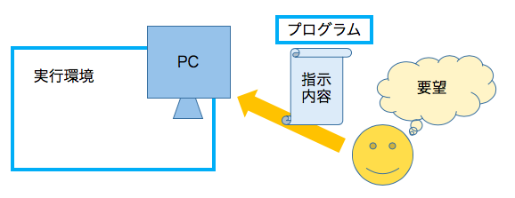
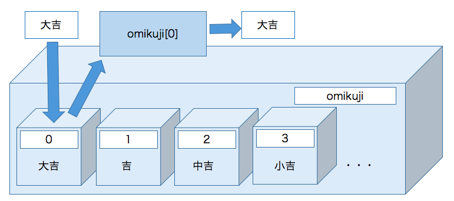
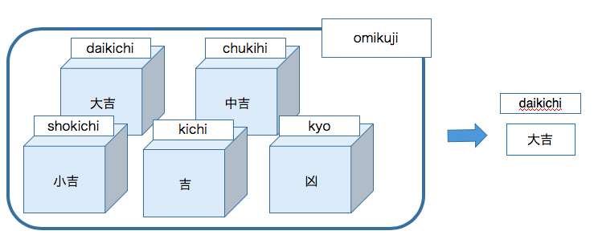
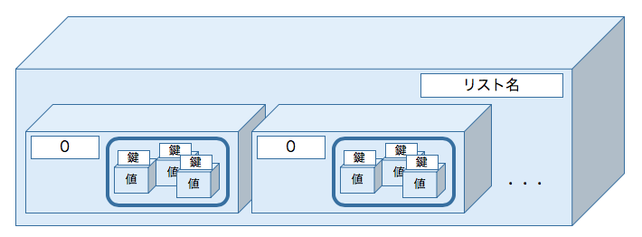
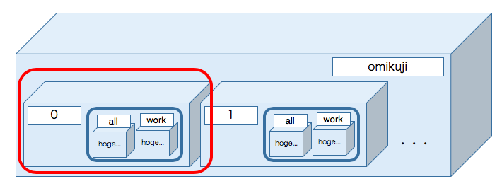

<!-- page_number: true -->

# 第1回 Pymee

---

# 事前準備確認

+ Pythonのインストール
+ 勉強資料のダウンロード


# 参加にあたっての注意事項
+ 私用PCは執務室で使用しないで下さい
+ zoom配信を行いますのでご了承下さい
+ 不明点は気軽に聞いて下さい！

---

# はじめに

+ Pymeeとは？
    + Python meeting
    + Pythonで何かしよう！
    + 今年度はPython勉強会を企画
+ メンバー紹介

---
# 勉強会について
+ ゴール
    + 自分でプログラムを作れるようになる
+ どうやって
    + おみくじプログラムを全3回の勉強会で作成
    + プログラム作成を通してpythonの知識をつける

---

# 勉強会の予定
+ 2018/8/22 第１回目
    + おみくじプログラムを通して基本的な文法学習
+ 2018/11下旬
    + おみくじプログラムを通してファイルの入出力
+ 2019/2下旬
    + おみくじプログラムとDBを連携させる

---

# 今日の内容

1. プログラミングって？
1. 実際のプログラムを書いてみよう！
1. おみくじの種類を増やそう
1. 名前を入力しよう
1. 自動で結果を出力しよう
1. もっと短くしてみよう
1. 違う方法でやってみよう
1. おみくじに仕事運を追加しよう
1. 「結果」によってメッセージを出力しよう

---

# プログラミングって？
+ コンピュータにやってもらい処理を書いて指示する事
+ 指示内容について書いたものが「プログラム」
+ プログラムを実行するには「実行環境」が必要


---

# プログラミングって？
+ 実行環境には大きく２種類ある
    + インタプリタ
        - 翻訳しながら逐次実行する
        - コンパイルが不要なため実行までにかかる手間が少ない
        - 比較的実行速度が遅い
    + コンパイラ
        - 一旦翻訳して翻訳結果を実行する
        - 比較的実行処理が早い
        - コンパイルの手間が必要
        - 実行するハードウェアごとにコンパイルが必要
        (javaなど必要ないよう工夫している言語もある)

---

# プログラミング言語って？

+ マシンに実行させる処理を書く言語
    - java, C, C#, ruby  などなど
    
---

# Pythonって？
+ 複数あるプログラミング言語の一種
    - Python2とPython3があり2は廃止予定
    - <u>pymeeでは **Python3** のみを使用</u>
+ 名前の由来はイギリスのコメディ番組

---

# 実際にプログラムを作ってみよう！
+ プログラムを実行すると、コンソールもしくはコマンドプロンプトに **「あなたの運勢は、大吉 すべてよし」** と出力されるプログラムを作ってみよう！

---

# やり方
1. 勉強用フォルダ「pymee1」を作成  
**ここでフォルダのフルパスをメモして下さい**
2. 勉強会用フォルダにテキストファイル「01_print.py」を作成
3. 下記内容を入力
```
# printは()の中身を表示してくれます。
print('あなたの運勢は、大吉 すべてよし')
```
**注意**  
ファイルの文字コードは **utf-8** で保存して下さい！!

---

# やり方
4. コマンドプロンプト(windowsの場合)、もしくはターミナル(Mac)を開く
5. 作成したテキストファイルの場所まで移動
```
$ cd <項番1で確認したフォルダのパス>
```
6. プログラムの実行
+ windowsの場合
```
$ py test.py
```
+ windows以外の場合
```
$ python3 test.py
```
7. 「あなたの運勢は、大吉 すべてよし」と出力されることを確認

---

# プログラムの実行
プログラムの実行方法は下記の通りです
1. 処理内容を書いたファイルを作成
2. 下記コマンドをコンソールもしくはターミナルに入力しプログラムを実行
+ windowsの場合
```
py ファイル名.py
```
+ その他の場合
```
python3 ファイル名.py
```
Python3を使用していることを意識するため、以降のスライドではファイル実行時のコマンドを **「python3 ファイル名.py」** とします。  
<u>windowsをご利用の方は「python3」を「py」に置き換えて実行して下さい。</u>

---

# 次は・・・
実際に作成したファイルの内容を確認します!

---

# コメント文
+ 先頭が「#」で始まる文
  プログラム実行時に無視される
  プログラムの内容を補足に使用される
```
# printは()の中身を表示してくれます。
print('あなたの運勢は、大吉 すべてよし')
```

---

# 文字、値を出力する
> print('出力する文字')

（）内の中身を表示する
文字列を出力するには「'」か「"」で囲む必要がある
```
# printは()の中身を表示してくれます。
print('あなたの運勢は、大吉 すべてよし')
```
「'」か「"」で囲まないとエラーが出力され実行がうまくいかない
```
$ python 01_print.py
File "01_print.py", line 4
 print(あなたの運勢は、大吉すべてよし)
                        ^
SyntaxError: invalid character in identifier
```

---

# 関数
+ 関数とは？
	
    + 特定の機能(与えた文字を出力する)を持つプログラムの塊
    + print()は関数、「print」が関数名
    + ()の中に記述するものを「引数(ひきすう)」という
    + 関数を実行した際に、戻る値を「戻り値」という
+ 組み込み関数
    + 元から使えるようになっている関数

---

# データ型とは？
+ 扱うデータの種類

データ型 | 具体例
--- | ---
文字列 | こんにちは、名前、pymee
数値 | 1, 100, 80
浮動小数点数 | 1.09, 20.59
Boolean | True, False

+ Pythonでは自動で判別のため、データ型の宣言は不要
  + メリット: 型の宣言が不要なためプログラミングにかける時間が少なくて済む事が多い
  + デメリット: コードが大規模になると可読性が下がる

---

# 型は値をしまう箱

> print('あなたの運勢は、大吉すべてよし')

'あなたの運勢は、大吉すべてよし'の型は**文字列**  
箱(オブジェクト)を作成して値である文字列を格納している

---

# 型の種類を確認する
> type(確認する値)

値の型を確認することができる

+ プログラムの内容
```
print("あなたの運勢は、大吉すべてよし")
print(type("あなたの運勢は、大吉すべてよし"))
```
+ 出力結果
'str'は文字列のこと
```
$ python 01_print.py
あなたの運勢は、大吉すべてよし
<class 'str'>
```

---

# まとめ
+ プログラミングって？
    + コンピュータにやってもらいたいことを書いて実行する
    + 処理を書く言語のことをプログラミング言語という
    いろんな種類がありその1つがPython
+ プログラムの実行までの流れ
    + 処理内容を書いた「ファイル名.py」を作成
    + 「python3 ファイル名.py」もしくは「py ファイル名.py」で実行
+ 型って？
    + 値をしまう箱の種類

---

# 今日の内容

1. ~~プログラミングって？~~
1. ~~実際のプログラムを書いてみよう！~~
1. おみくじの種類を増やそう
1. 名前を入力しよう
1. 自動で結果を出力しよう
1. もっと短くしてみよう
1. 違う方法でやってみよう
1. おみくじに仕事運を追加しよう
1. 「結果」によってメッセージを出力しよう

---
# おみくじの種類を増やそう
+ １種類を５種類にしよう！
    - 大吉 すべてよし
    - 中吉 まあまあよし
    - 小吉 よし
    - 吉 すこしよし
    - 凶 わるし

---
# どうやって？

今までのプログラム
```
print("あなたの運勢は、大吉すべてよし")
```
printの中身を5つ分書き換えるのは手間...  
**変数**　を使用する！

---

# 変数とは？
 
+ 値が入っている箱につけたラベル

+ 箱のラベル、つまり変数を指定することで中身であるデータを取り出すことができる
    + print(変数) を実行すると、変数の中身が出力される

---

# 変数の定義
> 変数名 = 値

+ 上記の形で変数とそれに格納する値を定義することが可能

```
omikuji_1 = '大吉 すべてよし'
```
+ 変数「omikuji_1」に「'大吉 すべてよし'」という値を格納している

---

# 変数の定義の注意事項
+ 使用可能な文字
    + 小文字の英字(a-z)
    + 大文字の英字(A-Z)
    + 数字(0-9)
    + アンダースコア(\_)
+ 先頭が数字、もしくはアンダースコアは使えない
+ 特定の単語はすでに予約されており使えない
    + False, classなど

---

# print(omikuji_1)の流れ
1. 箱のラベルが「omikuji_1」のものを見つける
1. print()が箱の中身を出力する
<br>


---

# 文字列と変数の組み合わせ
+ 文字列と変数を組み合わせるには「+」を使用する

```
>>> 
>>> omikuji_1 = '大吉 すべてよし'
>>> 
>>> print('あなたの運勢は ' + omikuji_1)
あなたの運勢は 大吉 すべてよし
>>>
```

---

# インタプリタの対話モードで動作確認をしてみよう！
+ 対話モードとは？
    + コードを読み取りつつ、実行することが可能
+ 使い方
    + 対話モードの起動
        - windowsの場合「py」と入力
        - それ以外は「python3.6」と入力
    + プロンプトが「>>>」となることを確認
    + そのまま実施したい処理を入力する
    + 対話モードを終了するときは「Ctrl」と「D」を同時に押下、もしくは「quit()」と入力

---

# 対話モードで動作確認をしてみよう！
変数の定義を対話モードを使用してやってみよう
1. インタプリタの対話モードを起動し、「>>>」が出力されることを確認

<font style = "font-size: 80%">

```
$ python3.6
Python 3.6.5 (default, May  4 2018, 21:19:29)
[GCC 4.2.1 Compatible Apple LLVM 9.1.0 (clang-902.0.39.1)] on darwin
Type "help", "copyright", "credits" or "license" for more information.
>>>
```

</font>

---

# 対話モードで動作確認をしてみよう！

2. 変数の定義
変数名 = 値 の形で定義
```
>>> omikuji_1 = '大吉 すべてよし'
```
3. 変数の中身を確認
変数名を入力して値を確認する
```
>>> omikuji_1
'大吉 すべてよし'
```

---

# 対話モードで動作確認をしてみよう！
4. 変数をprint()を使用して出力してみる
```
>>> print(omikuji_1)
大吉 すべてよし
```
「大吉 すべてよし 」が出力されることを確認する
このように変数を使用して値を扱うことができる

---

# 入力
> input(実行時に表示する値)

コマンドプロンプトやコンソールに入力された値を受け取る

> 変数 = input()

受け取った値を変数に格納することが可能


---

# 対話モードで動作確認をしてみよう！
自分の名前を入力して出力しよう
1. インタプリタの対話モードを起動し下記を入力
実行時に「>>」が出力されるので、名前を入力する
```
>>> name = input('>>')
>> 名前　※自分で入力する
```
2. 変数「name」の中身を確認
変数名「name」を入力、もしくはprint(name)を実行して入力した名前が表示されることを確認
```
>>> name
'名前'
>>>
>>> print(name)
名前
```

---

# おみくじプログラムを改良しよう！
1. おみくじの種類を５種類にする
2. おみくじを引く人の名前を入力する

---

# おみくじプログラムを改良しよう！
1. ファイル「01_print.py」をコピーして「02_variable.py」に変更
2. ファイルの先頭に５種類のおみくじをそれぞれ変数に格納  
**コメント文(#から始まる部分)は記載不要です**
```
# 代入
omikuji_1 = '大吉 すべてよし'
omikuji_2 = '中吉 まあまあよし'
omikuji_3 = '小吉 よし'
omikuji_4 = '吉 すこしよし'
omikuji_5 = '凶 わるし'
```
3. 出力用の変数「unsei」に出力させたいおみくじの変数を代入
```
# unseiにomikuji_1を代入
unsei = omikuji_1
```

---

# おみくじプログラムを改良しよう！
4. おみくじを引く人の名前の入力を促すメッセージを出力させます
```
print('あなたの名前を入力してください')
```
5. 入力された文字列を変数「name」に代入します
input実行時に「>>」を出力
```
# 名前を入力
name = input('>>')
```

---

# おみくじプログラムを改良しよう！
6. 最後におみくじ結果の部分を修正します
変数と文字列を組み合わせておみくじを引いた結果を出力させます
+ 修正前
```
# printは()の中身を表示してくれます。
print('あなたの運勢は、大吉 すべてよし')
```
+ 修正後
```
# 結果を出力
print(name + 'さんの運勢は、' + unsei + 'です!')
```

---

# 完成コード
```
# 代入
omikuji_1 = '大吉 すべてよし'
omikuji_2 = '中吉 まあまあよし'
omikuji_3 = '小吉 よし'
omikuji_4 = '吉 すこしよし'
omikuji_5 = '凶 わるし'

# unseiにomikuji_1を代入
unsei = omikuji_1

print('あなたの名前を入力してください')

# 名前を入力
name = input('>>')

# 結果を出力
print(name + 'さんの運勢は、' + unsei + 'です!')
```
---

# まとめ
+ 変数とは？
    + 値を格納する箱のラベル
+ 変数と文字列を一緒に出力するには？
    + print(変数 + '文字列')で出力可能
+ 入力するには？
    + input()を使用する

---

# 今日の内容

1. ~~プログラミングって？~~
1. ~~実際のプログラムを書いてみよう！~~
1. ~~おみくじの種類を増やそう~~
1. ~~名前を入力しよう~~
1. 自動で結果を出力しよう
1. もっと短くしてみよう
1. 違う方法でやってみよう
1. おみくじに仕事運を追加しよう
1. 「結果」によってメッセージを出力しよう

---

# 自動で結果を出力しよう
前回までのプログラムでは特定のおみくじを選んで出力していた
(大吉だけしか出ないようなおみくじに！)

このままでは、神主さんが誰かがプログラムを実行するたびに出力するおみくじの中身を書き換えないといけないことに！(運用でカバーというやつですね)

なので、ランダムでおみくじが出力されるようにプログラムを改良しよう！

---

# どうやって？
+ 0-4からランダムで数字を選択する
+ 選んだ数字によって出力するおみくじの内容を変える
    + 例) もし数字が「0」だったら「大吉 すべてよし」を出力

    | 数字 | おみくじ結果 |
    |:---:|:---|
    | 0 | 大吉 すべてよし |
    | 1 | 中吉 まあまあよし |
    | 2 | 小吉 よし |
    | 3 | 吉 すこしよし |
    | 4 | 凶 わるし |

---

# 0-4の数字からランダムで数字を選ぶ

> import random  
> random.randrange(start, stop[, step])  

startやstop、stepには整数を記載  
start以上end未満の整数から任意の整数を選択する  
step部分は増減部分を示しており、記載しなくても問題なし  
「import random」を定義しないと使えない  

+ 0-4(５未満なので)の整数から任意の数を選択している
```
>>> import random
>>> random.randrange(0,5)
1
>>> random.randrange(0,5)
4
>>> random.randrange(0,5)
3
```

---

# 選んだ数字によって出力するおみくじの内容を変える

**もし** 数字が「0」**だったら** (条件)、「大吉 すべてよし」を出力(処理)
+ 条件分岐
もし、条件1だったら、処理1を行う
```
if 条件１:
    処理１
```

---

# 条件分岐
```
if 条件1:
    処理1
elif 条件2:
    処理2-1
    処理2-2
else:
    処理3
```
1. もし、条件1に一致した場合は、処理1を実行
1. 条件1に一致せず、条件2に一致した場合は、処理2-1,2-2を実行
1. 条件1、条件2のどちらにも一致しなかった場合は、処理3を実行
+ 処理の部分は先頭にスペースを4つ入力する必要がある、処理が１行以上ある場合は全てについて先頭にスペース4つをつける
+ elifの条件から処理、elseの条件から処理の部分は必須ではない

---

# 条件部分の記述
+ 比較演算子を使用する

| 条件 | 演算子 | 使用例 | 使用例意味|
|---|:---:|:---:|---|
| と等しい| == | x == 1| xが１と等しい |
| と等しくない| != | x != 1| xが１と等しくない |
| より小さい| < | x < 1| xが１より小さい |
| 以下| <= | x <= 1| xが１以下 |
| より大きい| > | x > 1| xが１より大きい |
| 以上| >= | x >= 1| xが１以上|
| 要素になっている| in | x in y | xはyに含まれている|

---

# おみくじプログラムを改良しよう！
1. 0-4の数字からランダムで数字を選択する
    + random.randrange(0, 5)で0−4から任意の整数を選択し変数「num」に代入
2. 選んだ数字によって出力するおみくじの内容を変える
    + 条件分岐の内容

    | 条件(numが〜だったら) | 処理(変数「unsei」に〜を代入) |
    |:---:|---|
    | 0 | 大吉 すべてよし |
    | 1 | 中吉 まあまあよし |
    | 2 | 小吉 よし |
    | 3 | 吉 すこしよし |
    | 4 | 凶 わるし |

---

# 0-4の数字から任意の数字を選ぶ
1. ファイル「02_variable.py」をコピーし、ファイル名を「03_ransu_if.py」にする
2. ファイルの先頭に、「import random」を追加
```
# モジュールをインポート
import random
```

---

# 0-4の数字から任意の数字を選ぶ
3. 変数の下に、「random.randrange()」を追加

<font style = "font-size: 80%">

```
# 代入
omikuji_1 = '大吉 すべてよし'
omikuji_2 = '中吉 まあまあよし'
omikuji_3 = '小吉 よし'
omikuji_4 = '吉 すこしよし'
omikuji_5 = '凶 わるし'

# random.randrangeは()の中の数字からランダムで数字を選択してくれます
# 選択した数字をnumに代入
num = random.randrange(0,6)
```
</font>

---

# 0-4の数字から任意の数字を選ぶ
4. 「3」の下に条件分岐を追加
```
# numに格納された数字によって出力される文字列を変更
if num == 0:
    unsei = omikuji_1
elif num == 1:
    unsei = omikuji_2
elif num == 2:
    unsei = omikuji_3
elif num == 3:
    unsei = omikuji_4
elif num == 4:
    unsei = omikuji_5
else:
    unsei = ""
```

---

# 完成コード(1/3)
```
# モジュールをインポート
import random

# 代入
omikuji_1 = '大吉 すべてよし'
omikuji_2 = '中吉 まあまあよし'
omikuji_3 = '小吉 よし'
omikuji_4 = '吉 すこしよし'
omikuji_5 = '凶 わるし'

# random.randrangeは()の中の数字からランダムで数字を選択してくれます
# 選択した数字をnumに代入
num = random.randrange(0,6)
```

---

# 完成コード(2/3)
```
# numに格納された数字によって出力される文字列を変更
if num == 0:
    unsei = omikuji_1
elif num == 1:
    unsei = omikuji_2
elif num == 2:
    unsei = omikuji_3
elif num == 3:
    unsei = omikuji_4
elif num == 4:
    unsei = omikuji_5
else:
    unsei = ""
```

---

# 完成コード(3/3)
```
print('あなたの名前を入力してください')

# 名前を入力
name = input('>>')

# 結果を出力
print(name + 'さんの運勢は、' + unsei + 'です!')
```

---


# 詳しく動作をみてみよう！
ランダムな値とおみくじ結果が一致しているか確認する
1. 変数numの後に動作確認用のコードを記載
```
# random.randrangeは()の中の数字からランダムで数字を選択してくれます
# 選択した数字をnumに代入
num = random.randrange(0,6)

# 動作確認用コード
print("num:" + num)

```

---

# 詳しく動作をみてみよう！

2. 再度実行し変数numの値とおみくじの結果を比較
3. 下記の想定結果通りになっていることを確認

+ 想定結果

	| 変数num | おみくじ結果|
	|:---:|---|
	| 0 | 大吉 すべてよし |
	| 1 | 中吉 まあまあよし |
	| 2 | 小吉 よし |
	| 3 | 吉 すこしよし |
	| 4 | 凶 わるし |

---

# 詳しく動作をみてみよう！

4. 追加した動作確認用コードを削除してコードを元に戻す
```
# random.randrangeは()の中の数字からランダムで数字を選択してくれます
# 選択した数字をnumに代入
num = random.randrange(0,6)

# 動作確認用コード
print("num:" + num)

```

---

# まとめ
+ 条件分岐
    + もし条件だったら処理を行う
    + 条件は比較演算子を使用して記述
```
if 条件1:
    処理1
elif 条件2:
    処理2
else:
    処理3
```

---

# 今日の内容

1. ~~プログラミングって？~~
1. ~~実際のプログラムを書いてみよう！~~
1. ~~おみくじの種類を増やそう~~
1. ~~名前を入力しよう~~
1. ~~自動で結果を出力しよう~~
1. もっと短くしてみよう
1. 違う方法でやってみよう
1. おみくじに仕事運を追加しよう
1. 「結果」によってメッセージを出力しよう

---

# もっと短くしてみよう
+ おみくじの数を増やす場合、下記3つの修正が必要
    1. 変数を定義
    2. random.randrange(0, 5)の部分を修正
    3. if文のelifを追加

+ もっとプログラムをシンプルなものにしよう！
+ そのために、**リスト** を使用する

---

# リストとは？
+ 今までは、箱に値を代入していた
+ リストの場合、これらの箱を1つの大きな箱にまとめる


---

# リストとは？
+ 大きな箱の中に、0から始まる番号が振られている複数の小箱がある
+ 小箱の中に値が代入されている
+ 振られた番号を元に小箱の値を取り出すことが可能


---

# 対話モードで動作確認をしてみよう！

+ リストの定義
> リスト名 = [値, 値, 値...]

```
>>> omikuji = ['大吉', '小吉', '吉', '吉']
```
+ リスト名を入力して中身を確認
```
>>> omikuji
['大吉', '小吉', '吉', '吉']
```

---

# 対話モードで動作確認をしてみよう！
+ 値の取り出し
> リスト名[オフセット]

オフセットとは小箱に振られた番号のこと
```
>>> omikuji[0]
'大吉'
>>> omikuji[1]
'小吉'
```
+ 下記のようにオフセットを範囲で指定することも可能(スライス)
```
>>> omikuji[0:3]
['大吉', '小吉', '吉']
```

---

# 対話モードで動作確認をしてみよう！
+ 値の削除
    + オフセットを指定しての削除
    > del リスト名[オフセット]

    「吉」を1つ削除する
    ```
    >>> omikuji
  ['大吉', '小吉', '吉', '吉']
    >>>
    >>> del omikuji[3]
    >>>
    >>> omikuji
    ['大吉', '小吉', '吉']
    ```

---

# 対話モードで動作確認をしてみよう！
+ 任意の場所へ追加
> リスト名.insert(オフセット, 値)
+ 「大吉」の横に「中吉」を追加する
オフセットは「0」から数える
```
>>> omikuji
['大吉', '小吉', '吉']
>>>
>>> omikuji.insert(1, '吉')
>>>
>>> omikuji
['大吉', '吉', '小吉', '吉']
```

---

# 対話モードで動作確認をしてみよう！
+ 値の削除
    + 値を元に削除
    > リスト名.remove(値)
    ```
    >>> omikuji
    ['大吉', '吉', '小吉', '吉']
    >>>
    >>> omikuji.remove('吉')
    >>>
    >>> omikuji
    ['大吉', '小吉', '吉']
    ```
    + オフセットが不明の時に便利

---

# 対話モードで動作確認をしてみよう！
+ 最後に値の追加
> リスト名.append(値)
```
>>> omikuji
['大吉', '小吉', '吉']
>>>
>>> omikuji.append('きょう')
>>>
>>> omikuji
['大吉', '小吉', '吉', 'きょう']
```

---

# 対話モードで動作確認をしてみよう！
+ 値の書き換え
> リスト名[オフセット] = 値
```
>>> omikuji
['大吉', '小吉', '吉', 'きょう']
>>>
>>> omikuji[3] = '凶'
>>>
>>> omikuji
['大吉', '小吉', '吉', '凶']
```

---

# おみくじプログラムを改良しよう
+ 5つの変数を1つのリストにまとめる
    + 変数を5つ準備しなくても、1つで問題ない
+ ifの部分にリストを使用する
    + random.randrange()で選んだ数字をリストのオフセットとして使用する

---

# 5つの変数を1つのリストにまとめる
1. ファイル「03_ransu_if.py」をコピーし、ファイル名を「04-1_list.py」にする
2. ファイル名「04-1_list.py」を開く

---

# 5つの変数を1つのリストにまとめる
3. 変数部分をリストに書き換える
+ 削除部分
```
# 代入
omikuji_1 = '大吉 すべてよし'
omikuji_2 = '中吉 まあまあよし'
omikuji_3 = '小吉 よし'
omikuji_4 = '吉 すこしよし'
omikuji_5 = '凶 わるし'
```
+ 追加部分
```
# リスト(omikuji)を作成
omikuji = ['大吉 すべてよし',
           '中吉 まあまあよし',
           '小吉 よし',
           '吉 すこしよし',
           '凶 わるし',
           ]
```

---

# ifの部分にリストを使用する
+ 削除部分
```
# numに格納された数字によって出力される文字列を変更
if num == 0:
    unsei = omikuji_1
elif num == 1:
    unsei = omikuji_2
elif num == 2:
    unsei = omikuji_3
elif num == 3:
    unsei = omikuji_4
elif num == 4:
    unsei = omikuji_5
else:
    unsei = ""
```
+ 追加部分
```
# omikuji[num]をunseiに代入
unsei = omikuji[num]
```

---

# 完成コード(1/2)
```
# モジュールをインポート
import random

# リスト(omikuji)を作成
omikuji = ['大吉 すべてよし',
           '中吉 まあまあよし',
           '小吉 よし',
           '吉 すこしよし',
           '凶 わるし',
           ]
# 乱数を生成
num = random.randrange(0,5)
```

---

# 完成コード(2/2)
```

# omikuji[num]をunseiに代入
unsei = omikuji[num]

print('あなたの名前を入力してください')

# 名前を入力
name = input('>>')

# 結果を出力
print(name + 'さんの運勢は、' + unsei + 'です!')
```

---

# もっと短くしよう！
+ この部分をもっと短くしてみよう！

> \# 乱数を生成
> num = random.randrange(0,5)
> \# omikuji[num]をunseiに代入
> unsei = omikuji[num]

---

# リストから任意の要素を取り出す
> import random  
> random.choice(list)

()の中に指定したリストから、任意の要素を出力する
```
>>> omikuji
['大吉', '中吉', '小吉', '吉', '凶']
>>>
>>> import random
>>> random.choice(omikuji)
'凶'
>>> random.choice(omikuji)
'大吉'
```

---

# 比較
+ 変更前
```
1. 乱数を生成
num = random.randrange(0,5)

2. omikuji[num]をunseiに代入
unsei = omikuji[num]
```
+ 変更後
```
1. リストからランダムで取り出し
random.choice(list)
```
<u> コメント文を除いた部分が **２行が１行になった！！** </u>

---

# なぜ短い方がいいのか？
+ ２行が１行になっただけでは？  
**プログラムは書く時間より読む時間の方が長い**

+ 基本的には、短くてシンプルな方が後から読みやすい
+ 他人が後から読んでもわかりやすいようにコメントを入れたり、変数名をわかりやすくするように心がけましょう

---

# おみくじプログラムを改良しよう
+ random.choice(list)を使用してプログラムを改良する
    + 変更前
    任意の整数を選択し、リストのオフセットを元におみくじ結果を選択
  + 変更後
    random.choice()を使用し、任意の要素を選択

---

# random.choice(list)を使用する
1. ファイル「04-1_list.py」をコピーし、ファイル名を「04-2_list.py」にする
2. ファイル名「04-2_list.py」を開く
3. 下記の部分を削除
```
# 乱数を生成
num = random.randrange(0,5)
```

---

# random.choice(list)を使用する
4. 変数「unsei」の中身を書き換える
+ 修正前
```
# omikuji[num]をunseiに代入
unsei = omikuji[num]
```
+ 修正後
```
#ランダムでおみくじを表示
unsei = random.choice(omikuji)
```

---

# 完成コード(1/2)
```
# モジュールをインポート
import random

# リスト(omikuji)を作成
omikuji = ['大吉 すべてよし',
           '中吉 まあまあよし',
           '小吉 よし',
           '吉 すこしよし',
           '凶 わるし',
           ]
```

---

# 完成コード(2/2)
```
#ランダムでおみくじを表示
unsei = random.choice(omikuji)

print('あなたの名前を入力してください')

# 名前を入力
name = input('>>')

# 結果を出力
print(name + 'さんの運勢は、' + unsei + 'です!')
```

---

# まとめ
+ リストとは
    + 複数を要素をまとめた大きな箱
    + 各要素には0からの番号が振られ、こちらを用いて値を取り出すことが可能
    + その他のリストの機能
        - https://docs.python.jp/3/tutorial/datastructures.html#more-on-lists

---

# 今日の内容

1. ~~プログラミングって？~~
1. ~~実際のプログラムを書いてみよう！~~
1. ~~おみくじの種類を増やそう~~
1. ~~名前を入力しよう~~
1. ~~自動で結果を出力しよう~~
1. ~~もっと短くしてみよう~~
1. 違う方法でやってみよう
1. おみくじに仕事運を追加しよう
1. 「結果」によってメッセージを出力しよう

---

# 違う方法でやってみよう
+ 辞書を使っておみくじプログラムを改良してみよう！

---

# 辞書とは？
+ 鍵と値で定義する
+ 「:」より左側が鍵の名前で、右側が鍵名に対応する値を示している
+ 鍵を元に値を取り出すのでリストと異なり値の順番は関係ない
+ 鍵は重複不可


---

# 辞書とは？

+ 定義方法
> 辞書名 = {鍵 : 値, 鍵 : 値, 鍵 : 値, ...}

```
omikuji = {'daikichi': '大吉',
           'chukihi': '中吉',
           'shokichi': '小吉',
           'kichi': '吉',
           'kyo': '凶'}
```


---

# 辞書とは？

+ リストのようにオフセットではなく、鍵名を使用して値を取り出す
```
>>> omikuji['daikichi']
'大吉'
```


---

# 対話モードで動作確認をしてみよう！
+ 辞書の定義
    > 変数名 = {鍵:値, 鍵:値, 鍵:値,...}

    - ２行目以降の先頭のスペースは見やすくするために入力しています
```
>>> omikuji = {'daikichi': '大吉',
...            'chukichi': '大吉',
...            'shokichi': '小吉',
...            'kyo': '凶'}
```
+ 「omikuji」の確認
    - 「omikuji」と入力して値を確認する
```
>>> omikuji
{'daikichi': '大吉', 'chukichi': '大吉',
 'shokichi': '小吉', 'kyo': '凶'}
```

---

# 対話モードで動作確認をしてみよう！
+ 鍵を使用しての値の取り出し
    > 変数名[鍵]

    - 鍵が「daikichi」の値を取り出す
    - 鍵を指定する際は、<u>[ ]を使用することに注意!!</u>
```
>>> omikuji['daikichi']
'大吉'
```
---

# 対話モードで動作確認をしてみよう！

+ 値と鍵の追加
    > 変数名[鍵] = 値

    - 鍵が「kichi」、値が「吉」の要素を追加する
```
>>> omikuji['kichi'] = "吉"
```
+ 追加されていることを確認
```
>>> omikuji
{'daikichi': '大吉', 'chukichi': '大吉',
 'shokichi': '小吉', 'kyo': '凶', 'kichi': '吉'}
```

---

# 対話モードで動作確認をしてみよう！

+ 値の変更
    > 変数名[鍵] = 値

    - 鍵「chukichi」の値を「中吉」に変更する
```
>>> omikuji['chukichi'] = '中吉'
```
+ 変更されていることを確認
```
>>> omikuji
{'daikichi': '大吉', 'chukichi': '中吉',
 'shokichi': '小吉', 'kyo': '凶', 'kichi': '吉'}
```
---

# 対話モードで動作確認をしてみよう！

+ 値と鍵の削除
    > del 変数名[鍵]

    + 鍵が「kyo」の値を削除する
```
>>> del omikuji['kyo']
```
+ 削除されていることを確認
```
>>> omikuji
{'daikichi': '大吉', 'chukichi': '中吉',
 'shokichi': '小吉', 'kichi': '吉'}
```

---

# 対話モードで動作確認をしてみよう！
+ 鍵だけの取り出し
    > 変数名.keys()

    + dict_keysという型で出力される
```
>>> omikuji.keys()
dict_keys(['daikichi', 'chukichi', 'shokichi', 'kichi'])
```

+ 値だけ取り出し
    > 変数名.values()

    + dict_valuesという型で出力される
```
>>> omikuji.values()
dict_values(['大吉', '中吉', '小吉', '吉'])
```

---

# 対話モードで動作確認をしてみよう！
+ 鍵と値を取り出し
    > 変数名.items()

    + dict_itemsという型で出力される
```
>>> omikuji.items()
dict_items([('daikichi', '大吉'), ('chukichi', '中吉'),
('shokichi', '小吉'), ('kichi', '吉')])
```
---

# おみくじプログラムの改良
+ リストを辞書に書き換える
+ random.choice(list)の()の中身を辞書から取り出した鍵にする

---

# リストを辞書に書き換える
1. ファイル「04-2_list.py」をコピーし、ファイル名を「05_dict.py」にする
2. ファイル名「05_dict.py」を開く

---

# リストを辞書に書き換える
3. リストの部分を辞書に書き換える
+ 修正前
```
# リスト(omikuji)を作成
omikuji = ['大吉 すべてよし',
           '中吉 まあまあよし',
           '小吉 よし',
           '吉 すこしよし',
           '凶 わるし',
           ]
```
+ 修正後
```
omikuji = {'daikichi': '大吉 すべてよし',
           'chukihi': '中吉 まあまあよし',
           'shokichi': '小吉 よし',
           'kichi': '吉 少しよし',
           'kyo': '凶 わるし'
}
```

---

# リストを辞書に書き換える
4. 変数「unsei」の中身を書き換える
+ 変更前
```
#ランダムでおみくじを表示
unsei = random.choice(omikuji)
```
+ 変更後
```
#辞書(omikuji)のkeyをランダム取得し、unsei_keyに代入
# random.choiceするには、list化が必須のため、list()をしてます。
unsei_key = random.choice(list(omikuji.keys()))
```

---

# リストを辞書に書き換える
> list()

+ リストに変換する
```
>>> omikuji.keys()
dict_keys(['daikichi', 'cyukichi', 'syoukichi', 'kichi',
            'kyo'])
>>>
>>> list(omikuji.keys())
['daikichi', 'cyukichi', 'syoukichi', 'kichi', 'kyo']
```

---

# 完成コード(1/2)
```
# モジュールをインポート
import random

# リスト(omikuji)を作成
omikuji = ['大吉 すべてよし',
           '中吉 まあまあよし',
           '小吉 よし',
           '吉 すこしよし',
           '凶 わるし',
           ]
```

---

# 完成コード(2/2)
```
#ランダムでおみくじを表示
unsei = random.choice(omikuji)

print('あなたの名前を入力してください')

# 名前を入力
name = input('>>')

# 結果を出力
print(name + 'さんの運勢は、' + unsei + 'です!')
```

---

# まとめ
+ 辞書とは
    + {鍵 : 値}の形で定義し、鍵を使用して値を取り出す
    + リストと異なり鍵を使用して値を取り出すため順番は関係ない

---

# 今日の内容

1. ~~プログラミングって？~~
1. ~~実際のプログラムを書いてみよう！~~
1. ~~おみくじの種類を増やそう~~
1. ~~名前を入力しよう~~
1. ~~自動で結果を出力しよう~~
1. ~~もっと短くしてみよう~~
1. ~~違う方法でやってみよう~~
1. おみくじに仕事運を追加しよう
1. 「結果」によってメッセージを出力しよう

---

# おみくじに仕事運を追加しよう
+ 今までは「大吉」や「中吉」といった全体運だけ
+ このおみくじに「仕事運」の項目を追加する

---

# おみくじに仕事運を追加しよう

+ リストの値を辞書にする
リストの中に辞書を入れる、辞書の値をリストにすることも可能
> 変数名 = [ {鍵:値}, {鍵:値}, {鍵:値},...]
```
omikuji = [
 {'all':全体運の内容1,'work':仕事運の内容1},
 {'all':全体運の内容2,'work':仕事運の内容2},...]
```


---

# 値が辞書の場合
+ 値の構造について

> omikuji = \[  
>  {'all':全体運の内容1,'work':仕事運の内容1}, **←omikuji[0]**  
>  {'all':全体運の内容2,'work':仕事運の内容2}, **←omikuji[1]**  
>  ...]  

{'all':hogehoge,'work':hogehoge}という辞書がomikuji(リスト)の1つの値になっている


---

# 値が辞書の場合
+ 値の取り出し
    - 辞書1つを取り出す場合はリストと同様にオフセットを指定する
  ```
    >>> omikuji[0]
    {'all': '全体運の内容1', 'work': '仕事運の内容1'}
    ```


---

# 値が辞書の場合
+ 値の取り出し
    - 辞書の値を取り出す場合はオフセットによって取り出した値の鍵を指定する
    ```
    >>> omikuji[0]['all']
    '全体運の内容1'
    ```


---

# おみくじプログラムの改良
+ 変数「omikuji」の値に「仕事運」の項目を追加する

---

# 変数「omikuji」の値に「仕事運」の項目を追加する
1. ファイル「05_dict.py」をコピーし、ファイル名を「06_nest.py」にする
2. ファイル名「06_nest.py」を開く

---

# 変数「omikuji」の値に「仕事運」の項目を追加する
3.　変数「omikuji」を下記のように修正する
+ 修正前
```
omikuji = {'daikichi': '大吉 すべてよし',
           'chukihi': '中吉 まあまあよし',
           'shokichi': '小吉 よし',
           'kichi': '吉 少しよし',
           'kyo': '凶 わるし'}
```
+ 修正後
<font style = "font-size: 80%">

```
# 辞書が内包されたリストを作成
omikuji = [
 {'all':'大吉! すべてよし。 ','work':'仕事運:プロジェクトは大成功！'},
 {'all':'中吉! まぁまぁよし。 ','work':'仕事運:定時で帰れます！'},
 {'all':'小吉! よし。 ','work':'仕事運:ミスなく過ごせます！'},
 {'all':'吉! 少しよし。 ','work':'仕事運:思ったよりも上手くいくかも'},
 {'all':'凶! わるし。 ','work':'仕事運:些細なミスが命取りに！'}]
```
</font>

---

# 変数「omikuji」の値に「仕事運」の項目を追加する

4. random.choice()の修正
+ 修正前
```
#辞書(omikuji)のkeyをランダム取得し、unsei_keyに代入
# random.choiceするには、list化が必須のため、list()をしてます。
unsei_key = random.choice(list(omikuji.keys()))
```
+ 修正後
```
# omikuji内の辞書からランダムで取得
unsei = random.choice(omikuji)
```

---

# 変数「omikuji」の値に「仕事運」の項目を追加する
5. 出力結果の修正
<font style = "font-size: 80%">

+ 修正前
```
# 結果を出力
print(name + 'さんの運勢は、' + omikuji[unsei_key] +'です!')
```
+ 修正後
```
# 結果を出力
print(name + 'さんの運勢は、' + unsei['all']+ '\n' + unsei['work'])
```
+ \n は改行を示している
</font>

---

# 完成コード(1/2)
<font style = "font-size: 80%">

```
# モジュールをインポート
import random

# 辞書が内包されたリストを作成
omikuji = [
 {'all':'大吉! すべてよし。 ','work':'仕事運:プロジェクトは大成功！'},
 {'all':'中吉! まぁまぁよし。 ','work':'仕事運:定時で帰れます！'},
 {'all':'小吉! よし。 ','work':'仕事運:ミスなく過ごせます！'},
 {'all':'吉! 少しよし。 ','work':'仕事運:思ったよりも上手くいくかも'},
 {'all':'凶! わるし。 ','work':'仕事運:些細なミスが命取りに！'}]

# omikuji内の辞書からランダムで取得
unsei = random.choice(omikuji)
```
</font>

---

# 完成コード(1/2)
<font style = "font-size : 80%">

```
print('あなたの名前を入力してください')

# 名前を入力
name = input('>>')

# 結果を出力
print(name + 'さんの運勢は、' + unsei['all']+ '\n' + unsei['work'])
```
</font>

---

# 動作を確認しよう！
+ unseiの値をprintで取り出してみよう！
<font style = "font-size: 80%">

```
# モジュールをインポート
import random

# 辞書が内包されたリストを作成
omikuji = [
 {'all':'大吉! すべてよし。 ','work':'仕事運:プロジェクトは大成功！'},
 {'all':'中吉! まぁまぁよし。 ','work':'仕事運:定時で帰れます！'},
 {'all':'小吉! よし。 ','work':'仕事運:ミスなく過ごせます！'},
 {'all':'吉! 少しよし。 ','work':'仕事運:思ったよりも上手くいくかも'},
 {'all':'凶! わるし。 ','work':'仕事運:些細なミスが命取りに！'}]

# omikuji内の辞書からランダムで取得
unsei = random.choice(omikuji)

# unseiの値を確認
print(unsei)
```
</font>

---

# 動作結果
+ 「unseiの値を確認」を追加し実行すると。。。

<font style = "font-size: 80%">

```
$ python3 06_nest_test.py
{'all': '大吉! すべてよし。 ', 'work': '仕事運:プロジェクトは大成功！'}
あなたの名前を入力してください
>>pymee
pymeeさんの運勢は、大吉! すべてよし。
仕事運:プロジェクトは大成功！
```
</font>

+ { }なので出力された値が辞書であること
+ 結果を出力させる最後のprint()のunsei['all']、unsei['work']と、unseiの確認で追加したprint()によって出力された結果の対応を確認
<font style = "font-size: 80%">

> \# 結果を出力  
> print(name + 'さんの運勢は、' + unsei['all']+ '\n' + unsei['work'])  

</font>

---

# 確認部分の削除
+ 確認が終わったので、追加した「unseiの値を確認」部分を削除する

```
# unseiの値を確認
print(unsei)
```

---

# まとめ
+ リストの要素を辞書にしたり、辞書の要素をリストにすることが可能

---

# 今日の内容

1. ~~プログラミングって？~~
1. ~~実際のプログラムを書いてみよう！~~
1. ~~おみくじの種類を増やそう~~
1. ~~名前を入力しよう~~
1. ~~自動で結果を出力しよう~~
1. ~~もっと短くしてみよう~~
1. ~~違う方法でやってみよう~~
1. ~~おみくじに仕事運を追加しよう~~
1. 「結果」によってメッセージを出力しよう

---

# おみくじ結果によってメッセージを出力する
+ 全体運に「吉」が含まれていた場合は「いい一日になるといいですね！」と出力する
+ 全体運が含まれていない場合は、「こういう日もあります。元気出してください！！」と出力する

---

# おみくじ結果によってメッセージを出力する
+ ifを使用して処理内容を変える
    + 全体運に「吉」が含まれていた場合は(条件)「いい一日になるといいですね！」と出力する(処理)
+ 文字列にある文字が含まれているかを確認するには「in」を使用する
    + '吉' in '大吉'
        + 一致する(true)
    + '吉' in '凶'
        + 一致しない(false)

---

# おみくじプログラムを改良する
1. ファイル「06_nest.py」をコピーし、ファイル名を「07_if_in.py」にする
2. ファイル名「07_if_in.py」を開く
3. 一番下の行に下記を追加する
```
# 運勢が吉以上かで判断
if '吉' in unsei['all']:
    print('いい一日になるといいですね！')
else:
    print('こういう日もあります。元気出してください！')
```

---

# 復習！
+ ifって？
条件1に合う場合(真,True)は処理１を実行、条件1に合わない場合はelse後の処理2を実行する
```
if 条件1:
    処理1
else:
  処理2
```
elifやelseは省略可能

---

# 完成プログラム(1/2)
<font style = "font-size: 80%">

```
# モジュールをインポート
import random

# 辞書が内包されたリストを作成
omikuji = [
 {'all':'大吉! すべてよし。 ','work':'仕事運:プロジェクトは大成功！'},
 {'all':'中吉! まぁまぁよし。 ','work':'仕事運:定時で帰れます！'},
 {'all':'小吉! よし。 ','work':'仕事運:ミスなく過ごせます！'},
 {'all':'吉! 少しよし。 ','work':'仕事運:思ったよりも上手くいくかも'},
 {'all':'凶! わるし。 ','work':'仕事運:些細なミスが命取りに！'}]

# omikuji内の辞書からランダムで取得
unsei = random.choice(omikuji)
```

</font>

---

# 完成プログラム(1/2)
<font style = "font-size: 80%">

```
print('あなたの名前を入力してください')

# 名前を入力
name = input('>>')

# 結果を出力
print(name + 'さんの運勢は、' + unsei['all']+ '\n' + unsei['work'])

# 運勢が吉以上かで判断
if '吉' in unsei['all']:
    print('いい一日になるといいですね！')
else:
    print('こういう日もあります。元気出してください！！')
```

</font>

---

# まとめ
+ 「in」は「〜を含んでいる」という比較演算子

---

# 今日の内容振り返り

1. プログラミングって？(**指示内容を記述**)
1. 実際のプログラムを書いてみよう！(**print()**)
1. おみくじの種類を増やそう(**変数**)
1. 名前を入力しよう(**input()による入力**)
1. 自動で結果を出力しよう(**ifによる条件分岐**)
1. もっと短くしてみよう(**リスト**)
1. 違う方法でやってみよう(**辞書**)
1. おみくじに仕事運を追加しよう(**リストと辞書の組み合わせ**)
1. 「結果」によってメッセージを出力しよう(**in**)

みなさん長い間お疲れ様でした！

---

# 最後に
+ 次回予告
おみくじ内容をファイルから読み込んだり、書き込んだりする！

---

# アンケート
+ アンケートにご協力ください
+ tocaroグループ
疑問、不明点を気軽に聞いてください！
