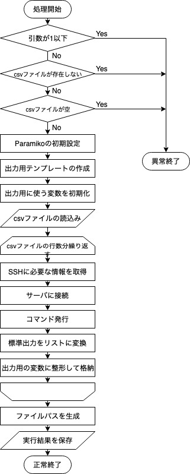

# Pymee2019 第1回勉強会サンプルプログラム

このプログラムはPymee2019 第1回勉強会のサンプルプログラムです。  
2018年の勉強会で学んだことを使って作っています。  
一部変なところもあるかもしれないですが、動いてるので今回はよし。  


## コードの解説

コードと何をやっているのかを簡単に書いていきます。
実行する際には以下のコマンドを実行をしてからやると開発者と同じ環境で実行できます。
```sh
source venv/bin/activate
pip install -r requirements.txt
```

```python
#!/user/bin/env python3

import csv
import os
import string
import sys
from datetime import datetime

import paramiko

```

1行目はShebangで3行目以降は各種ライブラリをimportしています。

---

```python
# コマンドライン引数の数のチェック
if len(sys.argv) <= 1:
    print("Usage: {} <csvfile>".format(sys.argv[0]), file=sys.stderr)
    sys.exit(1)

# コマンドライン引数で指定したcsvファイルがなければ終了させる
if not os.path.exists(sys.argv[1]):
    print("ERROR: CSVファイルが見つかりません")
    sys.exit(1)
elif os.path.getsize(sys.argv[1]) <= 10:
    print("ERROR: ファイルが空の可能性があります。")
    sys.exit(1)
```

 コメントでも書いてあるように、引数チェックとファイルの存在をチェックしています。  
 `elif os.path.getsize(sys.argv[1]) <= 10:`の部分はファイルが空かどうかの判定で使っています。  
 他にもいい方法があると思いますが、IPアドレスだけで10文字は行くと思ったのでこの書き方してみました。
 
 ---
 
 ```python
# Paramikoをインスタンス化して初期設定とか済ませておく
ssh = paramiko.SSHClient()
ssh.load_system_host_keys()
ssh.set_missing_host_key_policy(paramiko.AutoAddPolicy())
```

Paramikoモジュールをインスタンス化してから各種設定しています。  
詳しくはGoogle先生に聞いてください。

---

```python
# 出力用のテンプレートを生成
templates_text = string.Template("""\
====================
IPアドレス: $ipaddr
ログインユーザ: $username
実行時刻: $nowtime
====================
# $command
$command_result

""")
```

stringライブラリを使って出力用のテンプレートを定義しています。  
`$ipaddr`とか`$username`のところを簡単に置き換えます。  
結構便利なので覚えておくといいと思います。  
テキストファイルとして保存して、open関数で開いて使うこともできます。

---

```python
# CSVファイルを開いてIPアドレス、ユーザ名、パスワード、コマンドを取り出したあとにコマンドを実行して出力テキストを生成
with open(sys.argv[1], 'r') as csv_file:
    csv_reader = csv.reader(csv_file)

    for row in csv_reader:
        if not row[0] == "":
            hostname = row[0]
            username = row[1]
            password = row[2]
        command = row[3]

        # サーバに接続
        try:
            ssh.connect(hostname=hostname, username=username, password=password,
                        port=22, timeout=15.0, look_for_keys=False)
        except paramiko.ssh_exception.AuthenticationException as e:
            print("ERROR: SSH接続に失敗しました。", file=sys.stderr)
            sys.exit(1)

        # コマンド発行
        stdin, stdout, stderr = ssh.exec_command(command)

        command_result = ""

        # 標準出力のリストをリスト内包表記で作る
        for i in stdout:
            command_result += i.strip('\n') + '\n'

        contents += templates_text.substitute(ipaddr=hostname, username=username,
                                              nowtime=datetime.now().strftime("%H:%M"),
                                              command=command, command_result=command_result)
```

今回のプログラムで一番重要なところです。主に以下の順番で処理しています。
1. csvファイルを開いて`csv.reader`を使ってカンマ区切りで2次元のリストにする
1. for文を使ってリストから一行ずつ取り出して、hostnameとかを代入する。この時にhostnameが空だったらusernameへの代入はしないようにする
1. ちょっと前にインスタンス化したparamikoでサーバにSSH接続する。例外はAuthonicationExceptionでキャッチしてます。
1. コマンド実行。3つの戻り地があるので3つの変数に代入してます。
1. command_result変数を初期化する
1. リスト内包表記でstdout変数の中の文字列をリストにする
1. stringライブラリのsubstituteメソッドを使ってテンプレートの置換後にcontents変数に追記
2番目のfor文で3〜7をcsvのファイルの行数分だけ繰り返しています。

---

```python
# 保存場所の定義（全角にしたのは定数として認識しやすくするためで、Pythonでは特に意味は持たない）
SAVE_FILE_PATH = "./results/"
SAVE_FILE_NAME = "out_{}.txt".format(datetime.now().strftime("%Y%m%d%H%M"))

SAVE_PATH = SAVE_FILE_PATH + SAVE_FILE_NAME

# resultsフォルダがあるかチェックしてなければ作成
if not os.path.exists(SAVE_FILE_PATH):
    os.mkdir(SAVE_FILE_PATH)

# 同じファイル名があるかチェックしてから保存処理
try:
    if os.path.isfile(SAVE_PATH):
        raise FileExistsError()
    with open(SAVE_PATH, 'a', encoding='UTF-8') as f:
        f.write(contents)

    print("保存完了！")
except FileExistsError:
    print("ファイル名 [{}] は重複しています。".format(SAVE_FILE_NAME), file=sys.stderr)
    sys.exit(1)
```

1. 保存するフォルダとファイル名を変数に代入  
1. 保存するフォルダがなければ`os.mkdir`を使って作成
1. ファイルを保存する。このときに同名ファイルがあったらエラーを出力して終了させる

---

## 簡単なフローチャート


