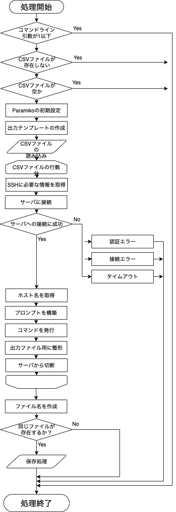

# Pymee2019 第1回勉強会サンプルプログラム

このプログラムはPymee2019 第1回勉強会のサンプルプログラムです。  
2018年の勉強会で学んだことを使って作っています。  
一部変なところもあるかもしれないですが、動いてるので今回はよし。  
また、一部説明にコードを書いてない場合もあるのでご注意ください。
  
実行する際に以下のコマンドを実行すると開発者と同じ環境で実行できます。
```sh
source venv/bin/activate
pip install -r requirements.txt
```

## コードの解説

コードと何をやっているのかを簡単に書いていきます。

```python
import csv
import os
import string
import sys
from datetime import datetime

import paramiko
```

各種ライブラリをimportしています。

---

```python
# コマンドライン引数の数のチェック
if len(sys.argv) <= 1:
    print("Usage: {} <csvfile>".format(sys.argv[0]), file=sys.stderr)
    sys.exit(1)

# csvファイルのパスを変数に格納
csv_file_path = sys.argv[1]

# コマンドライン引数で指定したcsvファイルがなければ終了させる
if not os.path.exists(csv_file_path):
    print("ERROR: CSVファイルが見つかりません", file=sys.stderr)
    sys.exit(1)

if os.path.getsize(csv_file_path) == 0:
    print("ERROR: ファイルが空の可能性があります。", file=sys.stderr)
    sys.exit(1)
```

コマンドライン引数の数のチェックと、CSVファイルがあるかをチェックしています。  
`elif os.path.getsize(csv_file_path) == 0:`の部分はファイルが空かの判定をするために使っています。  　
今回はこの方法を使いましたが、他により良い方法があると思います。

 ---
 
 ```python
# Paramikoをインスタンス化して初期設定とか済ませておく
ssh = paramiko.SSHClient()
ssh.load_system_host_keys()
ssh.set_missing_host_key_policy(paramiko.AutoAddPolicy())
```

Paramikoモジュールをインスタンス化してから各種設定しています。  
詳しくはGoogle先生に聞いてください。

---

```python
# 出力用のテンプレートを生成
templates_text = string.Template("""\
==============================
IPアドレス: $ipaddr
ログインユーザ: $username
実行時刻: $nowtime
==============================
$command
$command_result

""")
```

stringライブラリを使って出力用のテンプレートを定義しています。  
`$ipaddr`とか`$username`のところを簡単に置換出来ます。  
結構便利なので覚えておくといいと思います。  
テキストファイルとして保存して、open関数で開いて使うこともできます。

---

```python
# CSVファイルを開いてIPアドレス、ユーザ名、パスワード、コマンドを取り出したあとにコマンドを実行して出力テキストを生成
with open(csv_file_path, 'r') as csv_file:
    csv_reader = csv.reader(csv_file)

    for row in csv_reader:
        if not (row[0] == "" and row[1] == "" or row[0] == "" and row[1] == "" and row[2] == ""):
            hostname = row[0]
            username = row[1]
            password = row[2]
        command = row[3]

        # サーバに接続
        try:
            ssh.connect(hostname=hostname, username=username, password=password,
                        port=22, timeout=10.0, look_for_keys=False)
        except paramiko.ssh_exception.AuthenticationException as e:
            print("ERROR: SSH認証に失敗しました。", file=sys.stderr)
            sys.exit(1)
        except paramiko.ssh_exception.NoValidConnectionsError:
            print("ERROR: 接続エラー。", file=sys.stderr)
            sys.exit(1)
        except socket.timeout:
            print("ERROR: タイムアウトしました。", file=sys.stderr)
            sys.exit(1)

        # ホスト名を取得 Linuxの $HOSTNAME 環境変数でホスト名を取得
        stdin, stdout, stderr = ssh.exec_command("echo $HOSTNAME")
        server_hostname = stdout.readline().strip("\n")

        # プロンプトの構築
        prompt = "[{user}@{hostname}]".format(user=username, hostname=server_hostname) 
        
        # 三項演算子を使用して一行でif-elseを書く
        prompt += "# " if username == "root" else "$ "

        # コマンド発行
        stdin, stdout, stderr = ssh.exec_command(command)

        command_result = ""

        # stdoutからコマンド実行結果を取り出す
        for i in stdout:
            command_result += i.strip('\n') + '\n'

        contents += templates_text.substitute(ipaddr=hostname, username=username,
                                              nowtime=datetime.now().strftime("%H:%M"),
                                              command=prompt+command, command_result=command_result)

        # 念の為コネクションをクローズしておく
        ssh.close()
```

今回のプログラムで一番重要なところ(？)です。主に以下の順番で処理しています。
1. csvファイルを開いて`csv.reader`を使ってカンマ区切りで2次元のリストにする
1. for文を使ってリストから一行ずつ取り出して、hostnameとかを代入する。
1. インスタンス化済みのparamikoでサーバにSSH接続する。※例外処理については、のちほど記載しています
1. ホスト名の取得してPROMPTを構築
1. コマンドを実行
1. 実行結果を取り出して`contents`変数に格納
1. 念の為に接続をクローズ

 ### 例外処理について
 今回はSSH接続時の例外処理として、3種類用意しています。
 1. paramiko.ssh_exception.AuthenticationException
     * この部分は認証エラーの際に例外をキャッチします
 1. paramiko.ssh_exception.NoValidConnectionsError
     * この部分は接続エラーの際に例外をキャッチします
 1. socket.timeout
     * この部分はタイムアウトの際に例外をキャッチします。
     * SSH接続をする際の引数にtimeoutを指定することにより使えます

---

```python
# 保存ファイル名の定義（全角にしたのは定数として認識しやすくするためで、Pythonでは特に意味は持たない）
SAVE_FILE_NAME = "out_{}.txt".format(datetime.now().strftime("%Y%m%d%H%M"))

# 保存処理
try:
    with open(SAVE_FILE_NAME, 'x', encoding='UTF-8') as f:
        f.write(contents)

    print("保存完了！")
except FileExistsError:
    print("ファイル名 [{}] は重複しています。".format(SAVE_FILE_NAME), file=sys.stderr)
    sys.exit(1)
```

1. 保存するファイル名を定義
1. 保存処理

---

## フローチャート

