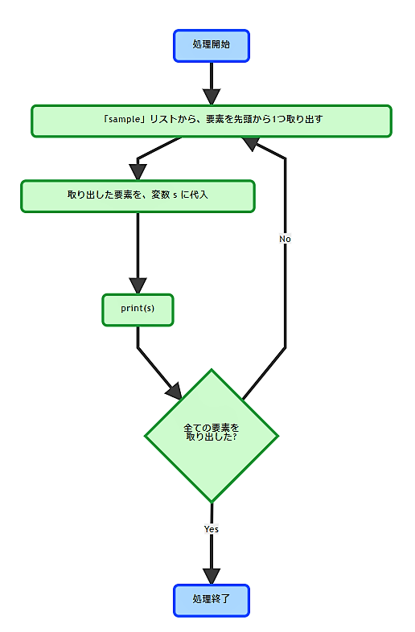
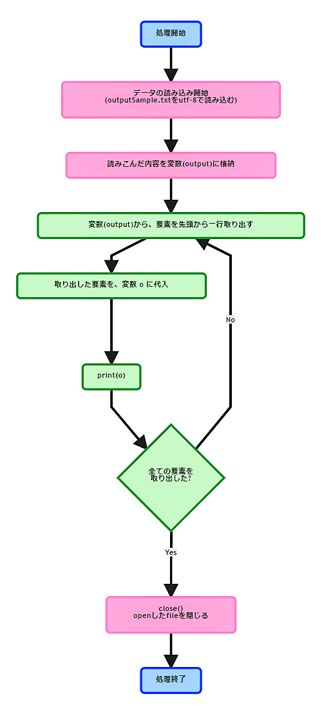
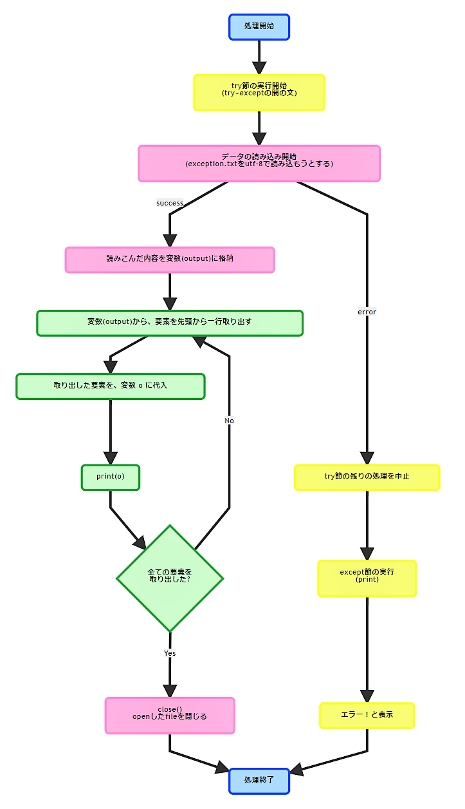

<!-- page_number: true -->

# 第3回 Pymee

---

# 事前準備確認

+ Pythonのインストール
+ テキストエディタのインストール(vi, vimでも可)
+ 勉強資料のダウンロード


# 参加にあたっての注意事項
+ 私用PCは執務室で使用しないで下さい
+ zoom配信を行いますのでご了承下さい
  + 今回から録画も行います
+ 不明点は気軽に聞いて下さい！

---

# 今日の内容

1. 前回のおさらい(リスト/辞書型)
1. for文
1. ファイル読み込み
1. 例外

---
# 今回の講義で利用する知識

今回の講義は前回までの講義を踏まえた上で実施します。

+ 変数(自分で名前をつける物)
+ 関数(print()など)
+ リスト([A,B,C])
+ 辞書型({a:A,b:B})

---
# 前回のおさらい

前回学んだコードをおさらいしましょう。

---

# リスト
```python
# リスト(omikuji)を作成
# omikujiという名前の変数にリスト型で一つずつ値を格納している。
omikuji = ['大吉',
           '中吉',
           '小吉',
           '吉',
           '凶'
           ]
print(omikuji[0])
```
+ 出力結果
```
大吉 すべてよし
```
---
+ omikujiという名前の大きな箱に0から順番に番号の付けられた小さな箱が格納されているイメージ

---
# 辞書型
```python
# 辞書(omikuji)を作成
# omikujiという名前の変数に辞書型で
# 一組ずつ「鍵：値」の形で格納している。
omikuji = {"大吉":"すべてよし",
           "中吉":"まあまあよし",
           "小吉":"よし",
           "吉":"すこしよし",
           "凶":"わるし",
           }
print(omikuji["大吉"])
```
+ 出力結果
```
すべてよし
```
---
+ それぞれの値が格納された箱を開ける鍵を指定するイメージ

---
# 思い出せましたか？この知識を前提に、本日の講義を行います。
---
# for文とは？

for文はリストから値を取得して、先頭から１つずつ値を取り出しながら繰り返し(ループ)処理を実装する事ができます。

---


---
【例文(for文)】
```python
#「sampleList」という名前のリストを作成
sampleList = [1,2,3,4,5]

#for文で「sampleList」の中身を一つずつ取り出してループ
#先頭から取り出して末尾までループする。
for number in sampleList:
    print(number)
```
+ 出力結果
```
1
2
3
4
5
```
---
記載した通り、for文は指定したリストにある値を全て出力する事が前提の作りになっています。
※リスト以外にもタプル、辞書、文字列などから一個づつ値を取り出せます。

ですが、以下のRange関数を併用するとリストの準備なしで指定した回数だけループできます。

【例文(for文+Range関数)】
```python
#range(数字)で0～(記載した数)の数字が入った
#range型オブジェクト(リストのような物)が作れる。
#
#下記の例文だと0～9(10個)の値が入った
#range型オブジェクトが作られる。
for number in range(10):

#出力時に+1して1～10で出力させる。
    print(number+1)
```
---
+ 出力結果
```
1
2
3
4
5
6
7
8
9
10
```

※10回ループしますが、出力は0から始まるので出力される値が0～9になります。その為、出力時の記載をs+1にして1～10を表示しています。
※考え方としては「0から数字を10個並べたリストが作成される」

---
## サンプルプログラムを作ってみましょう(for文)

【事前準備】
デスクトップ(どこでもいいです)に作業フォルダを作成し、そこへ以下の名前でテキストファイルを作成して下さい。作成したファイルにサンプルプログラムを記載して保存して下さい。
※全部コピペで張ってしまってOKです。

+ ファイル名

```
01_for.py
```
---

【サンプルプログラム】

```python
#「omikujiList」というリストを作成
omikujiList = ['仕事運 まあまあよし',
           '恋愛運 よし',
           '健康運 すこしよし'
           ]

#for文で「omikujiList」の中身を一つずつ取り出してループ
#先頭から取り出して末尾までループする。
for omikuji in omikujiList:
    print (omikuji);
```
---
コードが書けたら以下のコマンドで実行してみましょう。
+ 実行(windowsの場合)

```
py 01_for.py
```
+ 実行(その他の場合)

```
python3 01_for.py
```
+ 出力結果
```
仕事運 まあまあよし
恋愛運 よし
健康運 すこしよし
```
---
# ファイルから文字列を読み込んでみよう

現場でpythonを利用するのであれば、ファイル入出力は避けて通れない道です。
まずはファイルから文字を読み込んでみましょう。
※今後「I/O」と言う単語が出てきますが、「INPUT/OUTPUT」の略称で「入力(読み込み)/出力(表示)」を指しています。

---


---
【例文(ファイルI/O)】

```python
#読み込むファイルを指定。
#この書式で記載すると以下の通りに値が格納される。
#　・ファイル読み込み元：
#      inputSample.txt
#　・ファイルから読み込んだ中身の格納先：
#      inputAll(一行ずつリスト形式で格納される)
inputAll = open("inputSample.txt", "r",encoding="utf-8")

#ファイルから読み込んだ中身を一行ずつfor文で出力する。
for inputLine in inputAll:
    print (inputLine, end='');

#見やすいように最後に改行を入れる
print('\n')

#ファイルを読み込んだ後はクローズ処理を記載する。
#これを書かないとメモリにゴミが残る。(動作が重くなっていく)
inputAll.close()
```
---
+ 出力結果
```
【大吉】
待人：辛抱強く待つべし
失物：足元にあり
恋愛：深入りするな
転居：無理せず待て
```

上記の文法で、ソースコード(.pyファイル)を配置したフォルダと同じフォルダに配置された「inputSample.txt」を読み込む事ができます。

---
## サンプルプログラムを作ってみましょう(ファイル読み込み)
【事前準備】
事前準備として、以下の内容を記載したテキストファイルを作業フォルダに保存しておいて下さい。

+ ファイル名

```
inputSample.txt
```
+ 記載内容

```
【大吉】
待人：辛抱強く待つべし
失物：足元にあり
恋愛：深入りするな
転居：無理せず待て
```
---
事前準備したファイルとは別に、以下のファイルを作成して下さい。

+ ファイル名

```
02_fileIO.py
```
【サンプルプログラム】

```python
#読み込むファイルを指定。
#ファイル読み込み元：inputSample.txt
inputAll = open("inputSample.txt", "r",encoding="utf-8")

for inputLine in inputAll:
    print (inputLine, end='');

print('\n')

inputAll.close()
```
---

+ 実行(windowsの場合)

```
py 02_fileIO.py
```
+ 実行(その他の場合)

```
python3 02_fileIO.py
```
+ 出力結果
```
【大吉】
待人：辛抱強く待つべし
失物：足元にあり
恋愛：深入りするな
転居：無理せず待て
```

ソースコードに直接記載されていた内容がテキストファイルにまとまっただけで、大分おみくじっぽくなってきたのではないでしょうか。

---
# 例外
日々業務を行っていると想定外の事が起こりえます。そんな時はフォローをして貰えると助かりますよね？
プログラムも人間が考えて作る物ですから、想定外の事ももちろん発生します。そんな時にフォローをしてあげる仕組みを学びましょう。
※ただし、そもそもプログラムが間違っている場合(構文エラー)は対象外です。

---



---


【例文(例外)】

<font style = "font-size: 97%">
   
```python
#エラーが発生した際に別処理へ遷移させたい箇所をtry～exceptで囲む。
#基本的に全部でいい。
try:

#例文として存在しないファイルを指定
#ファイル名を間違ったりして存在しないファイルを
#指定するとエラーになります。
    inputAll = open("exception.txt", "r",encoding="utf-8")

    for inputLine in inputAll:
        print (inputLine, end='');

    print('\n')

    inputAll.close()

#上記のexception.txtが存在しない為、
#エラーが発生して以下のexceptと記載された箇所の処理が実行される。
#
#エラーが発生しなかった場合はexcept句に記載されたコードは
#実行されない。
except:
    print("エラー！")
```
</font>

---

+ 出力結果
```
エラー！
```

---

## ポイント
+ try～exceptを記載する事で、処理に失敗した場合のフォローができる。
　⇒エラーが発生した箇所でプログラムの実行がする事を防げる。

## 用途
+ 中途半端に動いてしまった際の後始末
+ 発生したエラーの詳細をログファイルへ記載
etc...

---
## サンプルプログラムを作ってみましょう(例外)

+ ファイル名

```
03_except.py
```

---

【サンプルプログラム】(1/2)
```python
#エラー発生時の詳細取得準備
import sys

#エラーが発生した際に別処理へ遷移させたい箇所をtry～exceptで囲む。
try:

#例文として存在しないファイルを指定
    inputAll = open("exception.txt", "r",encoding="utf-8")

    for inputLine in inputAll:
        print (inputLine, end='');

    print('\n')

```
---
【サンプルプログラム】(2/2)
```python
#ファイルが見つからない時は以下のコードが実行される。
#sys.exc_info()でエラーの詳細を確認できる。
except FileNotFoundError:
    print("ファイル読み込みエラー！")
    print(sys.exc_info())
#その他のエラー発生時は以下のコードが実行される。
except:
    print("その他のエラー！")
    print(sys.exc_info())
#エラーが発生しなかった場合は以下のコードが実行される。
else:
    print('※例外は発生しませんでした')
#以下のコードはどんな場合でも実行される。
finally:
    print('処理終了')
#ファイルがオープンできている場合のみクローズ処理を実施する。
    if 'inputAll' in locals():
        inputAll.close()
```

---

+ 実行(windowsの場合)

```
py 03_except.py
```
+ 実行(その他の場合)

```
python3 03_except.py
```
+ 出力結果
```
ファイル読み込みエラー！
処理終了
Traceback (most recent call last):
～

```
---
## 4つのexcept句
+ except FileNotFoundError:
　⇒対象ファイルが存在しない時に実行される
+ except:
　⇒全てのエラー発生時に実行される
+ else:
　⇒全て正常に処理された場合に実行される
+ finally:
　⇒どんな場合でも実行される

## ポイント
+ 上から順番に処理される
　⇒exceptを一番上に書くとそこで処理されてしまうので、個別エラー処理を先に書く
+ sys.exc_info()でエラーの詳細を取得できる
※事前に「import sys」の記述が必要

---

# まとめ(1/3)
1. 前回のおさらい(リスト/辞書型)

```python
omikuji = ['大吉 すべてよし',
           '中吉 まあまあよし',
           '小吉 よし',
           '吉 すこしよし',
           '凶 わるし',
           ]
print(omikuji[0])
```
```python
omikuji = {"大吉":"すべてよし",
           "中吉":"まあまあよし",
           "小吉":"よし",
           "吉":"すこしよし",
           "凶":"わるし",
           }
print(omikuji["大吉"])
```

---

# まとめ(2/3)
2. for文
```python
sampleList = [1,2,3,4,5]
for sample in sampleList:
    print(sample)
```
3. ファイル入出力
```python
inputAll = open("inputSample.txt", "r",encoding="utf-8")
for inputLine in inputAll:
    print (inputLine, end='');
print('\n')
inputAll.close()
```

---

# まとめ(3/3)
4. 例外
```python
try:
    inputAll = open("exception.txt", "r",encoding="utf-8")

    for inputLine in inputAll:
        print (inputLine, end='');
    print('\n')

except FileNotFoundError:
    print("ファイル読み込みエラー！")
except:
    print("エラー！")
else:
    print('※例外は発生しませんでした')
finally:
    print('処理終了')
    if 'inputAll' in locals():
        inputAll.close()
```
---
## サンプルプログラムを作ってみましょう(まとめ)

前頁を踏まえ、次のコードを作成して下さい。

【事前準備】
事前準備として、以下の内容を記載した３つのテキストファイルを作業フォルダに保存しておいて下さい。

①
+ ファイル名

```
daikiti.txt
```
+ 記載内容

```
【大吉】
待人：辛抱強く待つべし
失物：足元にあり
恋愛：深入りするな
転居：無理せず待て
```

---

②
+ ファイル名

```
kiti.txt
```
+ 記載内容

```
【吉】
待人：待てば来る
失物：見つからず
恋愛：良い出会いあり
転居：南東が良し
```
---

③
+ ファイル名

```
kyo.txt
```
+ 記載内容

```
【凶】
待人：来ない
失物：増える
恋愛：刺される
転居：燃える
```
---
事前準備したファイルとは別に、以下のファイルを作成して下さい。

+ ファイル名

```
04_summary.py
```
---

【サンプルプログラム】(1/3)
```python
import sys
#ランダムで値を取り出す為の準備
import random

#エラーが発生した際に別処理へ遷移させたい箇所をtry～exceptで囲む。
try:

#おみくじ用ファイルを読み込む
    daikiti = open("daikiti.txt", "r",encoding="utf-8")
    kiti    = open("kiti.txt", "r",encoding="utf-8")
    kyo     = open("kyo.txt", "r",encoding="utf-8")

#読み込んだおみくじ用ファイルを辞書型でまとめる
    inputOmikuji = {"大吉":daikiti,
                    "吉":kiti,
                    "凶":kyo}

#ランダムで選択する為のキーとなる単語をリストで用意
    omikujiList = inputOmikuji.keys()

#omikujiListの中からランダムで一つ選ぶ
    randomOmikuji = random.choice(list(omikujiList))
```
---
【サンプルプログラム】(2/3)
```python
#omikujiListからランダムに選んだ運勢(文字列)をキーにしてinputOmikujiにセットしたテキストファイルの中身から選んだ文字列に対応するファイルの中身を読み込む。
    selectOmikuji = inputOmikuji[randomOmikuji]

#読み込んだファイルの中身を1行ずつ取り出す。
    for selectLine in selectOmikuji:
        print (selectLine, end='');

    print('\n')
```
---

【サンプルプログラム】(3/3)
```python
#ファイルが見つからない時は以下のコードが実行される。
except FileNotFoundError:
    print("ファイル読み込みエラー！")
    print(sys.exc_info())
#その他のエラー発生時は以下のコードが実行される。
except:
    print("その他のエラー！")
    print(sys.exc_info())
else:
    print('\nおみくじの結果はどうでしたか？')
#以下のコードはどんな場合でも実行される。
finally:
    if 'daikiti' in locals():
        daikiti.close()
    if 'kiti' in locals():
        kiti.close()
    if 'kyo' in locals():
        kyo.close()
```
---
+ 実行(windowsの場合)

```
py 04_summary.py
```
+ 実行(その他の場合)

```
python3 04_summary.py
```
---
+ 出力結果
※以下のいずれか
```
【大吉】
待人：辛抱強く待つべし
失物：足元にあり
恋愛：深入りするな
転居：無理せず待て
おみくじの結果はどうでしたか？
```
```
【吉】
待人：待てば来る
失物：見つからず
恋愛：良い出会いあり
転居：南東が良し
おみくじの結果はどうでしたか？
```
```
【凶】
待人：来ない
失物：増える
恋愛：刺される
転居：燃える
おみくじの結果はどうでしたか？
```

---
# みなさん長い間お疲れ様でした！

---

# 次回予告
+ 繰り返し処理第２弾
+ ファイルの書き込み

今回の範囲外のお話
+ with open

---

# アンケート
+ 今後のよりよい活動のため、アンケートにご協力ください！


https://questant.jp/q/WP4SJ79K

---
# おまけ
オライリーの「退屈なことはPythonにやらせよう」より、都道府県庁所在地クイズジェネレータのソースコードです。
今日の知識＋αで読めますので、講義だけでは物足りなかった方はどうぞ。
https://github.com/oreilly-japan/automatestuff-ja/blob/master/ch08/randomQuizGenerator.py

---
# ご質問など。。。
+ メーリングリストにて、疑問、不明点を気軽に聞いてください！
