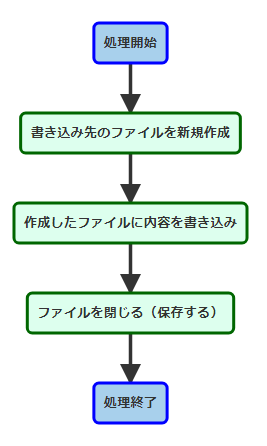

<!-- page_number: true -->

# 第4回 Pymee

---

# 事前準備確認

+ Pythonのインストール
+ テキストエディタのインストール(vi, vimでも可)
+ 勉強資料のダウンロード


# 参加にあたっての注意事項
+ 私用PCは執務室で使用しないで下さい
+ zoom配信を行いますのでご了承下さい
  + 録画も行います
+ 不明点は気軽に聞いて下さい！

---

# 今日の内容

1. 前回のおさらい(for文/ファイル読み込み/例外)
1. while文
1. ファイル書き込み
1. module

---
# 今回の講義で利用する知識

今回の講義は前回までの講義を踏まえた上で実施します。

+ for文
+ ファイル読み込み
+ 例外

---
# 前回のおさらい

前回学んだコードをおさらいしましょう。

---

# for文
```python
#「sampleList」という名前のリストを作成
sampleList = [1,2,3,4,5]

#for文で「sampleList」の中身を一つずつ取り出してループ
#先頭から取り出して末尾までループする。
for s in sampleList:
    print(s)
```
+ 出力結果
```
1
2
3
4
5
```
+ リストから値を取得して、先頭から１つずつ値を取り出しながら繰り返し(ループ)処理を実装できました。
---


---

# ファイル読み込み
```python
#読み込むファイルを指定。
output = open("outputSample.txt", "r",encoding="utf-8")

#ファイルから読み込んだ中身を一行ずつfor文で出力する。
for o in output:
    print (o, end='')

#見やすいように最後に改行を入れる
print('\n')

#ファイルを読み込んだ後はクローズ処理を記載する。
output.close()
```
---
+ 出力結果
```
【大吉】
待人：辛抱強く待つべし
失物：足元にあり
恋愛：深入りするな
転居：無理せず待て
```
+ ファイル読み込み元(inputSample.txt)から読み込んだ中身の格納先(inputAll)へ一行ずつリスト形式で格納されました。
+ ソースコード(.pyファイル)を配置したフォルダと同じフォルダに配置された「inputSample.txt」を読み込む事ができました。
---


---

# 例外
```python
#エラーが発生した際に別処理へ遷移させたい箇所をtry～exceptで囲む。
try:

#例文として存在しないファイルを指定
    output = open("exception.txt", "r",encoding="utf-8")

    for o in output:
        print (o, end='');

    print('\n')

    output.close()

#上記のexception.txtが存在しない為、
#エラーが発生して以下のexceptと記載された箇所の処理が実行される。
except:
    print("エラー！")
```
---
+ 出力結果
```
エラー！
```
---
+ try～exceptを記載する事で、処理に失敗した場合のフォローができました。
+ ファイル名を間違ったりして存在しないファイルを指定するとエラーになりました。
+ エラーが発生した箇所でプログラムが実行することを防げました。
+ エラーが発生しなかった場合はexcept句に記載されたコードは実行されませんでした。

---


---
# 思い出せましたか？この知識を前提に、本日の講義を行います。
---
# while文とは？

+ while文も、基本的にはfor文のように繰り返し処理を実行する構文です。
+ for文は、リストのように個数が決まっているデータに順々にアクセスする場合に便利でした。
+ while文は、繰り返し処理を回し続けるか、ストップするかを条件式で決めることができます。

---


---

【例文(while文)】
```python
#ランダムで値を取り出す為の準備
import random

#変数numの最初の数字を定義
num = 0

#while文で条件、および処理を定義
#「4以外の数字の間は変数numで0-9の乱数を表示する」
while num != 4:
    num = random.randint(0,9)
    print(num)
```
+ 出力結果
```
0
8
0
4
```
---

+ 最初はnumが0なので、while文の条件を満たし、ブロックの中のコードが実行されます。
+ random.randint(指定した範囲内でランダムに値を返す関数)によって0-9の乱数が発生して変数 num に格納され、print関数で表示します。
+ 2回目以降もこの動作を繰り返します。
+ 「4以外の数字」の条件を満たす間はループを継続し、num が 4 であれば条件を満たさないので、print関数で4を表示した後while文は終了します。

---

# サンプルプログラムで使うものを予習しよう

---

## readline()
Pythonでファイルの内容を取得するときには、以下の手順があります。
+ ファイルを開く
+ ファイルの内容を取得する
+ ファイルを閉じる

そして、ファイルの内容を取得する方法としては以下の関数があります。

|関数|処理|
|:--|:--|
|readline()|1行ずつ読み込む|
|readlines()|1行ずつ読み込んでリストに格納する|
|read()|ファイルを全て読み込む|

---

## append()
appendは日本語で「添える」、「付加する」という意味で文字通り、リストに要素を追加してくれます。

```python
a = [1,2,3]
print(a)
```
+ 出力結果
```
[1, 2, 3]
```
リストが表示されました。

---

この後リストに要素を追加したいなってときにappendを利用します。下記例では、"4" をリストに追加しています。

```python
a = [1,2,3]
a.append(4)
print(a)
```
+ 出力結果
```
[1, 2, 3, 4]
```
リストの中に要素が追加されました。

---

## サンプルプログラムを作ってみよう(while文)

【作成手順】
1. 任意の場所に作業用フォルダを作成
1. 作業用フォルダに、事前に配布（ダウンロード）したフォルダにある`while.txt`をコピー
1. 作業用フォルダに`01_while.py`ファイルを作成
1. 作成した`01_while.py`に以下のサンプルプログラムを書いて保存

---

尚、以下の処理をプログラム中で実行します。これらの内容を踏まえて作成してみて下さい。

 1. 空のリストを作成
 1. ファイルをオープン
 1. ファイルの内容を1行ずつ読み込み
 1. while文で条件（読み込んだ行がEOFでない）を満たす限り読み込んだ行をリストに追加し、次の行を読み込む
 1. ランダムでリストから取り出し、結果を表示

---

【サンプルプログラム(1/2)】

```python
import random

#ファイルを格納するためのリストを準備
WhileList = []

#読み込むファイルを指定してオープン
f = open("while.txt", "r",encoding="utf-8")

#readline()で1行ずつ読み込み
line = f.readline()

```
---

【サンプルプログラム(2/2)】

```python

#while文で処理を定義
#「取り出した行が "EOF" 以外なら1行ずつWhileListに格納」
while line != "EOF\n":
	WhileList.append(line)
	line = f.readline()

#読み込んだファイルをクローズ
f.close

#ランダムでリストから結果を取り出し
kekka = random.choice(WhileList)

#結果を表示
print(kekka)
```
---
コードが書けたら以下のコマンドで実行してみましょう。
+ 実行(windowsの場合)

```
py 01_while.py
```
+ 実行(その他の場合)

```
python3 01_while.py
```
+ 出力結果
```
大吉
```
---
+ 読み込んだ"while.txt" から1行ずつ取り出していき、EOFの行に差し当たると条件を満たさないので取り出さずに処理を停止します。
+ 出来上がったWhileListからランダムに1行取り出し、表示しています。
> while line != "EOF\n"
+ \n は改行コードです。while.txtの末尾に改行を入れている為、条件に加えています。

---
【問題(while文)】
+ while文を利用して10から50までの間の偶数のみを出力させて下さい。
  + ヒント
   + 演算子例
     + a += b  (a = a + b)
     + a <= b  (a が b 以下)
     + a >= b  (a が b 以上)
  + 演算子とは、足し算とか引き算、掛け算など計算で使われる記号や値の大小を比較する際に使われる記号のことです。
  + 間違って無限ループ(例えば10がずっと表示され続ける)を起こしてしまった場合は、Ctrl + C で抜けれます。

---
# ファイルを書き込んでみよう

前回、ファイル読み込みを学びましたが、今回はファイルへ書き込む方法を学びましょう。

---



---
【例文(ファイル書き込み)】

```python
#書き込むファイルを新規作成
f = open('kakikomi.txt','x')

#新規作成したファイルに書き込み
f.write('楽しいPython')

#書き込んだファイルを閉じる
f.close()

```
+ 出力結果
```
楽しいPython
```
---

+ 作業ディレクトリに"kakikomi.txt"が作成され、「楽しいPython」と書き込まれていることが確認できます。
+ open関数の書き込みモードには以下のものがあります。

|mode|処理|
|:--:|:--|
|x|ファイルを新規作成して書き込む。ファイルが存在する場合にはエラー（FileExistsError）となり、ファイルが存在しない場合のみファイルが書き込み用として開かれ保存（新規作成）される。|
|w|既存ファイルに書き込む。ファイルが存在しなければ新規作成、存在していれば上書き（既存の内容は削除）で保存される。|
|a|既存ファイルに追記する。ファイルが存在しなければ新規作成して書き込み、保存される。|

---

## サンプルプログラムを作ってみよう(ファイル書き込み)

【作成手順】
1. 作業用フォルダに、事前に配布（ダウンロード）したフォルダにある`write_file.txt`をコピー
1. 作業用フォルダに`02_file_write.py`ファイルを作成
1. 作成した`02_file_write.py`に以下のサンプルプログラムを書いて保存

---

尚、以下の処理をプログラム中で実行します。これらの内容を踏まえて作成してみて下さい。

 1. 既存ファイルを読み込み
 1. 書き込み先ファイルを新規作成してオープン
 1. 「読み込んだ内容＋飾り」を新規作成したファイルに書き込み

---

【サンプルプログラム】

```python
#読み込むファイルを指定してオープン
omikuji = open("write_file.txt", "r",encoding="utf-8")

#書き込み先のファイルを新規作成してオープン
f = open('write_kekka.txt','x')

#上部飾りを挿入
f.write("===============================\n")

#ファイルから読み込んだリストを一行ずつ最終行までfor文で書き込み
for i in omikuji:
    f.write(i)

#改行して下部飾りを挿入
f.write("\n")
f.write("===============================\n")

#ファイルクローズ
omikuji.close()
f.close()

print("write_kekka.txtに書き込みました!")
```
---

+ 実行(windowsの場合)

```
py 02_file_write.py
```
+ 実行(その他の場合)

```
python3 02_file_write.py
```
+ 出力結果（write_kekka.txt）
```
===============================
【大吉】
待人：辛抱強く待つべし
失物：足元にあり
恋愛：深入りするな
転居：無理せず待て
===============================
```

読み込んだファイルの内容の上下に飾りを挿入し、別ファイルに書き込むことができました。

---

【問題(ファイル書き込み)】
+ 任意の文字列を`write_kekka.txt`に追記してください。
  + ヒント
    + 先ほどの書き込みモード表を参照


---

# importとは

+ importとは、pythonで書かれたコードを再利用するために使用します。
+ importは一般的にコードの先頭に以下のように記述します。※importを入れる場所はどこでもよいです。限定的にimportしたい場合は、直前でimportしてもOKです。

```
import モジュール
```

---

## モジュール（module）とは

モジュールとは、pythonのファイル（.py）の事です。
+ 長いプログラムをpythonで書く場合は、コマンドラインではなく.pyファイルに実行したい内容を保存します。
+ 保存された.pyファイルは、他のpythonのプログラムからimportで呼び出して使うことができ、これをモジュールと呼びます。
+ 実行させたい機能を他の.pyファイルに書いておき、それをimportで呼び出すイメージです。

---

## datetimeモジュールのdatetimeクラスを利用しよう
+ 日付や時刻に対して色々な操作をすることが出来るモジュールを集めたdatetimeモジュールには、以下のようなクラスが含まれています。
+ 現段階では、複数の関数などをまとめたものがクラスだと理解しておけば十分です。

|クラス|説明|
|:--|:--|
|date|主に日付を表現|
|time|時刻を表現|
|datetime|日付と時刻を合わせて表現|
|timedelta|時間差を表現|

---

+ では、datetimeモジュールをimportする方法です。

```
import datetime
```
+ これでモジュール（＝.pyファイル）をimportでき、datetimeモジュール内のクラスがすべて使えるようになります。

---

実際に現在の日付や時刻を取得してみましょう。
+ datetime.datetime.now()　という構文で、datetimeモジュール（＝.pyファイル）のdatetimeクラスのnow()メソッドを呼び出します。
+ メソッドとは、ある処理のまとまりに名前をつけたものです。
+ 重複していて長いですが、短くする方法もあるのでそれはまた次回に！

```python
import datetime

date1 = datetime.datetime.now()
print(date1)
```
+ 出力結果
```
2019-02-21 11:27:29.172790
```
+ 現在の日付と時刻が取得できました。

---

次に、取得した日付と時刻を、任意のフォーマットの文字列に変換してみましょう。strftimeという関数を使って変換できます。
```python
import datetime

hizuke = datetime.datetime.now().strftime("%Y-%m-%d")
print(hizuke)
```

+ 出力結果
```
2019-02-21
```
+ datetime.datetime.now()で取得した日付と時刻を "yyyy-mm-dd" というフォーマットの文字列に変換できました。

---

+ 「%Y」や「%m」は日付フォーマット用のディレクティブです。
+ ディレクティブとは、プログラミングにおいてコマンドのような意味で使われる用語で、プログラミング言語の一部の構成要素のことです。以下に一覧を記載します。

|ディレクティブ|説明|
|:--|:--|
|%Y| 4桁の西暦(1989、2019)
|%m| 0埋めした月（01、12）
|%d| 0埋めした日付(01、31)
|%H| 0埋めした時刻(01、23)#24時間表記
|%I| 0埋めした時刻(01、12)#12時間表記
|%M| 0埋めした分（01、59）
|%S| 0埋めした秒(01、59)

---

+ 0埋めとは、桁数（文字数）を揃える目的で、左に「0」を何個かくっつけることです。
+ 例) 5桁に合わせる「12」→「00012」、「345」→「00345」


---
## サンプルプログラムを作ってみよう(モジュール)

【作成手順】
1. 作業用フォルダに`02_file_write.py`をコピーして`03_import.py`ファイルを作成
1. 作成した`03_import.py`に以下プログラム中の「以下挿入」もしくは「書き込み先ファイル名変更」とある部分を追記・変更して保存

---

尚、以下の処理をプログラム中で実行します。これらの内容を踏まえて作成してみて下さい。※新規で追加した処理

 1. datetimeモジュールをimport
 1. ファイル読み込み
 1. 現在の日付を取得し文字列に変換
 1. 日付を書き込み

---

【サンプルプログラム】(1/3)

```python
##################### 以下挿入 #####################
#datetimeモジュールをimport
import datetime
###################################################

#読み込むファイルを指定してオープン
omikuji = open("write_file.txt", "r",encoding="utf-8")

##################### 以下挿入 #####################
#現在時刻を"yyyy-mm-dd"の書式で文字列に変換する
hizuke = datetime.datetime.now().strftime("%Y-%m-%d")
###################################################

######## 書き込み先ファイル名変更 ###################
#書き込み先のファイルを新規作成してオープン
f = open('import_kekka.txt','x')
###################################################
```
---

【サンプルプログラム】(2/3)

```python
#上部飾りを挿入
f.write("===============================\n")

#ファイルから読み込んだリストを一行ずつ最終行までfor文で書き込み
for i in omikuji:
    f.write(i)

##################### 以下挿入 #####################
#改行を書き込み    
f.write("\n")

#日付を書き込み
f.write(hizuke)
###################################################

#改行して下部飾りを挿入
f.write("\n")
f.write("===============================\n")

```
---

【サンプルプログラム】(3/3)

```python

#ファイルクローズ
omikuji.close()
f.close()

##### write_kekka.txtをimport_kekka.txtに変更  #####

print("import_kekka.txtに書き込みました!")

####################################################
```
---

+ 実行(windowsの場合)

```
py 03_import.py
```
+ 実行(その他の場合)

```
python3 03_import.py
```

+ 出力結果（import_kekka.txt）
```
===============================
【大吉】
待人：辛抱強く待つべし
失物：足元にあり
恋愛：深入りするな
転居：無理せず待て
2019-02-03
===============================
```
先ほどのファイルの下部に日付が書き込まれましたね！

---

【問題(モジュール)】
+ 今日の日付を"YYYY/MM/DD HH:MM:SS"で表示するプログラムを作成してください。
  + ヒント
    + 先ほどのディレクティブ一覧を参照してみましょう。

---

# まとめプログラムで使うものを予習しよう

---

## sys.argv
sysモジュールのargvには、コマンドライン引数が入ったリストが格納されます。
+ コマンドライン引数とはプログラム実行時にコマンドラインで指定する引数のことです。
+ 外部のファイルでプログラムの挙動を変えたいときに指定します。
```
$ py XXXX.py 引数1 引数2...
```
---

では、sys.argvでコマンドライン引数の値を受け取るプログラムを作ってみます。

```python
import sys

value = sys.argv
print(value)
```
+ 出力結果（test.txtをコマンドライン引数に指定して実行）
```
['argv.py', 'test.txt']
```
+ 上記出力結果の通り、argvには0番目の要素に.pyファイル名が入り、1番目以降の要素にコマンドライン引数が入ります。
+ 例えば、コマンドライン引数として1番目に指定したファイルをUTF-8形式で読み取り専用で開く場合は以下のように記述します。
```python
    f = open(sys.argv[1], "r",encoding="utf-8")
```
---

## 文字列操作

pythonで実行可能な文字列操作は、連結、検索、変換、置換など様々ありますが、ここではsplit()で文字列を区切る方法を取り上げます。

```python
string = "Hello, World!"
result = string.split(",")
print(result)
```
+ 出力結果
```
['Hello', ' World!']
```
+ 元々あった「,」は消え、改めて「,」で区切られリスト化しています。

---

## raw文字列

raw文字列は、通常文字列の先頭に「r」又は「R」を付けたものです。
+ raw文字列ではエスケープシーケンス（通常文字列で表せない機能を、特別な文字の並びにより表したもの）が無効になり、例えば「\n」と記述されていたとしても改行と言う意味ではなく「\」と言う文字と「n」と言う文字が続いているだけの意味になります。
+ 例えば、Windowsのパスはバックスラッシュ(¥)で区切られているので、通常文字列を使うと毎回\\\のようにエスケープしなければいけませんが、raw文字列を使うとそのまま書けます。

---

+ 以下のプログラムで、エスケープした場合とr文字列にした場合とを比較できます。

```python
path = 'C:\\Windows\\system32\\cmd.exe'
rpath = r'C:\Windows\system32\cmd.exe'
print(path == rpath)
```
+ 出力結果
```
True
```
+ 等しいことが判りました。

---

## exit()
対話型（インタラクティブ）シェルを終了させる関数です。

```
C:\Users\pymee> python
>>>
>>> exit()
C:\Users\pymee>
```

---

## sys.exit()
実行しているプログラムの中でメインプロセスを終了させるための関数です。
+ 終了ステータスをつけることもできます。※終了ステータスとは、プログラムが正常に動いたかどうかを知らせるステータスのことです。
一般的には正常に終了した際には0を、エラーなどの異常が起きた場合は1を返します。

+ 例えば、コマンドライン引数の値をsys.argvで取得し、len()という要素数を調べることができる関数でコマンドライン引数の数をチェックすることで、条件を満たさない場合にプログラムを終了することもできます。

---

## format()
format関数は、変数を文字列へ埋め込みたいときに使われます。以下の構文で使用します。

```python
"任意の文字列{}任意の文字列".format(変数)
```
---

+ format関数には複数の変数を引数として渡し、文字列に埋め込むことができます。
+ 複数の変数を埋め込む場合は、どの引数をどの{}に埋め込むかを指定する必要があり、以下のような指定方法があります。

```
#インデックス（添え字）で指定
"{0},{1},..".format(変数1, 変数2, ..)

#キーワード引数で指定
"{h1},{h2},..".format(h1=変数1, h2=変数2, ..)  

#辞書で指定
"{h1},{h2},..".format(**{'h1':変数1, 'h2':変数2, ..} )  
```
+ 以下は、インデックスで指定した場合の例です。

```python
print("今日は{0}です！".format(hizuke))
```
変数"hizuke"の値が {0}の部分に挿入されます。

---

# サンプルプログラムを作ってみよう(まとめ)

---

これまでの内容を踏まえ、まとめのコードを作成しましょう。

【作成手順】
1. 作業用フォルダに`results`という名前でフォルダを作成（おみくじ結果の出力先となります。）
1. 作業用フォルダに、事前に配布（ダウンロード）したフォルダにある`omikujifile.txt`をコピー
1. 作業用フォルダに`04_summary_4th.py`ファイルを作成
1. 作成した`04_summary_4th.py`に以下のサンプルプログラムを書いて保存

---

尚、以下の処理をプログラム中で実行します。これらの内容を踏まえて作成してみて下さい。

+ 正常系
 1. おみくじファイルを読み込んでリスト化
 1. リスト化したおみくじファイルからランダムで結果を取り出し
 1. プログラム実行時の日時取得
 1. 取り出したおみくじの結果と日付を整形しファイルに書き込み

+ 異常系
 1. コマンドライン引数の数をチェック
 1. ファイルが読み込みできるかチェック

---

<font style = "font-size: 80%">

【サンプルプログラム】(1/3)

```python
import sys
import random
import datetime

#コマンドライン引数にファイルが一つ指定されていることをチェック
if len(sys.argv) != 2:
    sys.stderr.write('エラー:引数にファイルを一つ指定してください。\n')
    sys.exit(1)

#ファイルを格納するためのリストを準備
KekkaList = []

#コマンドライン引数に読み込むファイルを指定してオープン1行ずつリストに格納
try:
    f = open(sys.argv[1], "r",encoding="utf-8")
    line = f.readline()
    while line != "EOF\n":
        KekkaList.append(line)
        line = f.readline()
    f.close
```
</font>

---

<font style = "font-size: 80%">

【サンプルプログラム】(2/3)

```python
#例外をキャッチした場合の処理内容
except FileNotFoundError:
    sys.stderr.write("エラー:指定されたファイルが見つかりません。\n")
    sys.exit(1)
except:
    sys.stderr.write("エラー:その他のエラー。\n")
    sys.exit(1)

#ランダムでリストから結果を取り出し
kekka = random.choice(KekkaList)

#取り出した結果をカンマ区切りでリスト化
unsei = kekka.split(",")

#出力するファイル名に付与する日付を取得
hizuke = datetime.datetime.now().strftime("%Y-%m-%d")

#出力ファイル名を指定
#rで""内のエスケープシーケンス(¥nなど)を無効化
unsei_filename = r"./results/unsei_{0}.txt".format(hizuke)
```
</font>

---

<font style = "font-size: 80%">

【サンプルプログラム】(3/3)

```python
#出力ファイル名でファイルオープンし結果を書き込み
try:
    f = open(unsei_filename,'x')

#例外をキャッチした場合の処理内容
except FileExistsError:
        sys.stderr.write("エラー:同じ名前のファイルが既に存在しています。\n")
        sys.exit(1)
except FileNotFoundError:
        sys.stderr.write("エラー:ディレクトリが見つかりません。\n")
        sys.exit(1)
#上記2つのエラー以外のエラーをキャッチした場合の処理内容
#tracebackモジュールをimportしてエラー内容を出力
except:
    import traceback
    traceback.print_exc()

#おみくじの結果を書き込み
f.write("===============================\n")
for i in unsei:
    f.write(i)
    f.write("\n")
f.write("おみくじを引いた日:{0}".format(hizuke))
f.write("\n")
f.write("===============================\n")
f.close()

print("おみくじの結果を{0}に書込みました！".format(unsei_filename))
```
</font>

---

+ 実行(windowsの場合)

```
py 04_summary_4th.py omikujifile.txt
```
+ 実行(その他の場合)

```
python3 04_summary_4th.py omikujifile.txt
```
---
+ 出力結果（unsei_2019-02-10.txt）
```
===============================
大吉
待人：すぐに来る
失物：足元にあり
恋愛：深入りするな
転居：無理せず待て

おみくじを引いた日:2019-02-10
===============================
```
```
===============================
吉
待人：待てば来る
失物：見つからず
恋愛：よい出会いあり
転居：南東がよし

おみくじを引いた日:2019-02-10
===============================
```
---

```
===============================
凶
待人：来ない
失物：増える
恋愛：刺される
転居：燃える

おみくじを引いた日:2019-02-10
===============================
```
なかなか大吉が出ませんでした。。

---

# with構文
+ with構文は主に外部のファイルを扱う場面で活躍する構文です。
+ with構文を使うとファイルの読み込みで必要なclose処理を省略することが出来ます。

## with構文を使うメリット
+ with構文は、開始と終了に必ずしなければいけない一連の作業がある場合に活躍します。

---

例えば
+ ファイルのオープンとクローズ<br>
+ 通信の開始と終了<br>
+ データベースへのアクセスのオープンとクローズ
などが一般的ですね。
+ with構文を使う一番のメリットは、開始時と終了時の定型処理を必ず実行してくれるということです。

---

## with構文の使い方
ファイルのオープンとクローズの作業を、with構文を使って簡略化してみましょう。

```python
f = open("sample.txt", "r")
print(f.read())
f.close()
```
with構文を使うと以下のようになります。
```python
with open("sample.txt", "r") as f:
    print(f.read())
```
+ コードの行数が減り、読みやすくなりましたね。
+ 余裕のある方は、今回作成したコードを修正して違いを実感してみてください。

---

# 問題解答

## while文

```python
num = 10
while num<=50:
    print(num)
    num+=2
```
+ 出力結果
```
10
12
14
...
48
50
```
+ 変数numが50以下の間は、2を加算し続ける処理を行っています。
---

## ファイル書き込み

```python
f = open('write_kekka.txt','a')

f.write("今日も頑張ろう！")

f.close()
```

+ 出力結果
```
===============================
【大吉】
待人：辛抱強く待つべし
失物：足元にあり
恋愛：深入りするな
転居：無理せず待て
===============================
今日も頑張ろう！
```
---

## モジュール

```python
import datetime

now = datetime.datetime.now()
hizuke = now.strftime("%Y/%m/%d %H:%M:%S")
print(hizuke)
```
+ 出力結果

```
2019/02/20 00:16:35
```

---

# みなさん長い間お疲れ様でした！

---

# アンケート
+ 今後のよりよい活動のため、アンケートにご協力ください！

https://questant.jp/q/IUXNTTN3

+ 不明点はメーリングリストで気軽に聞いて下さい！
