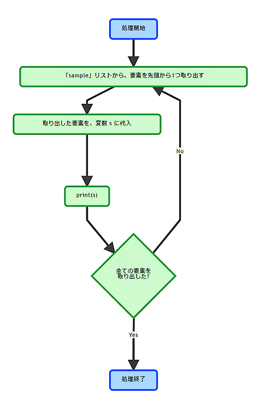
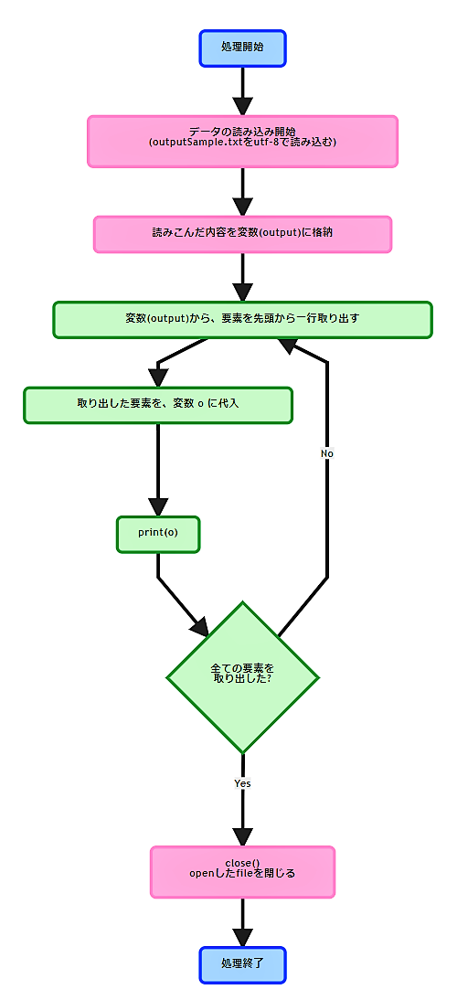
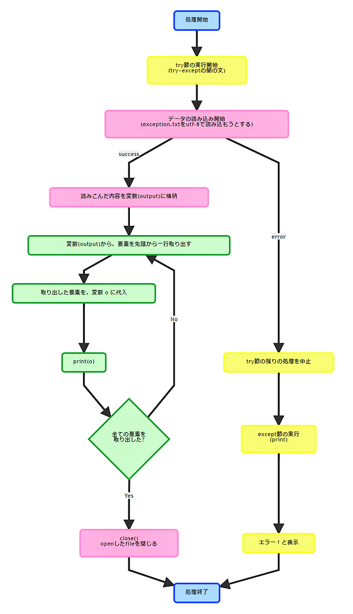
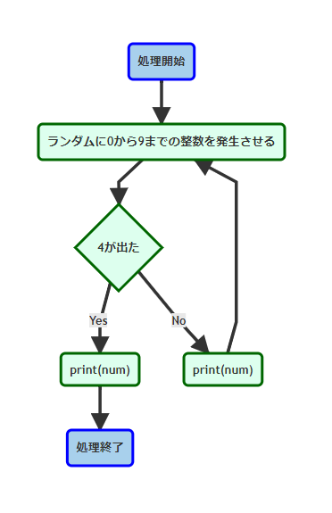

<!-- page_number: true -->

# 第4回 Pymee

---

# 事前準備確認

+ Pythonのインストール
+ テキストエディタのインストール(vi, vimでも可)
+ 勉強資料のダウンロード


# 参加にあたっての注意事項
+ 私用PCは執務室で使用しないで下さい
+ zoom配信を行いますのでご了承下さい
  + 録画も行います
+ 不明点は気軽に聞いて下さい！

---

# 今日の内容

1. 前回のおさらい(for文/ファイル読み込み/例外)
1. while文
1. ファイル書き込み
1. module

---
# 今回の講義で利用する知識

今回の講義は前回までの講義を踏まえた上で実施します。

+ for文
+ ファイル読み込み
+ 例外

---
# 前回のおさらい

前回学んだコードをおさらいしましょう。

---

# for文
```python
#「sampleList」という名前のリストを作成
sampleList = [1,2,3,4,5]

#for文で「sampleList」の中身を一つずつ取り出してループ
#先頭から取り出して末尾までループする。
for number in sampleList:
    print(number)
```
+ 出力結果
```
1
2
3
4
5
```
+ リストから値を取得して、先頭から１つずつ値を取り出しながら繰り返し(ループ)処理を実装できました。
---


---

# ファイル読み込み
```python
#読み込むファイルを指定。
#この書式で記載すると以下の通りに値が格納される。
#　・ファイル読み込み元：
#      inputSample.txt
#　・ファイルから読み込んだ中身の格納先：
#      inputAll(一行ずつリスト形式で格納される)
inputAll = open("inputSample.txt", "r",encoding="utf-8")

#ファイルから読み込んだ中身を一行ずつfor文で出力する。
for inputLine in inputAll:
    print (inputLine, end='');

#見やすいように最後に改行を入れる
print('\n')

#ファイルを読み込んだ後はクローズ処理を記載する。
#これを書かないとメモリにゴミが残る。(動作が重くなっていく)
inputAll.close()
```
---
+ 出力結果
```
【大吉】
待人：辛抱強く待つべし
失物：足元にあり
恋愛：深入りするな
転居：無理せず待て
```
---
+ ソースコード(.pyファイル)を配置したフォルダと同じフォルダに配置された「inputSample.txt」を読み込む事ができました。
---

---
---

# 例外
```python
#エラーが発生した際に別処理へ遷移させたい箇所をtry～exceptで囲む。
#基本的に全部でいい。
try:

#例文として存在しないファイルを指定
#ファイル名を間違ったりして存在しないファイルを
#指定するとエラーになります。
    inputAll = open("exception.txt", "r",encoding="utf-8")

    for inputLine in inputAll:
        print (inputLine, end='');

    print('\n')

    inputAll.close()

#上記のexception.txtが存在しない為、
#エラーが発生して以下のexceptと記載された箇所の処理が実行される。
#
#エラーが発生しなかった場合はexcept句に記載されたコードは
#実行されない。
except:
    print("エラー！")
```
---
+ 出力結果
```
エラー！
```
---
+ try～exceptを記載する事で、処理に失敗した場合のフォローができました。<br>
　⇒エラーが発生した箇所でプログラムが実行することを防げます。
---


---
# 思い出せましたか？この知識を前提に、本日の講義を行います。
---
# while文とは？

while文も、基本的にはfor文のように繰り返し処理を実行する構文です。<br>
for文は、リストのように個数が決まっているデータに順々にアクセスする場合に便利でした。<br>
while文は、繰り返し処理を回し続けるか、ストップするかを条件式で決めることができます。

---


---
【例文(while文)】
```python
#ランダムで値を取り出す為の準備
import random

#変数numの最初の数字を定義
num = 0

#while文で条件、および処理を定義「4以外の数字が出るまで変数numで0-9の乱数を表示する」
while num != 4:
	num = random.randint(0,9)
	print(num)
```
+ 出力結果
```
1
8
8
9
0
8
0
4
```
---
最初はnumが0なので、while文の条件を満たし、ブロックの中のコードが実行され、0-9の乱数が発生して変数に格納されます。2回目以降もこの動作を繰り返します。「4以外の数字」の条件を満たす間はループを継続し、num が 4 であれば条件を満たさないので、while文はそこで終了します。

---
## サンプルプログラムを作ってみましょう(while文)

【事前準備】<br>
デスクトップ(どこでもいいです)に作業フォルダを作成し、そこへ以下の名前でテキストファイルを作成して下さい。<br>
作成したファイルにサンプルプログラムを記載して保存して下さい。<br>
引数に指定するテキストファイル (while.txt) はこちらで用意したものを作業フォルダにコピーしておいてください。<br>
※尚、全部コピペで張ってしまってOKですが、コードに慣れる為に余裕がある方は手打ちしてみてください。<br>

+ ファイル名

```
01_while.py
```
---

【サンプルプログラム】

```python
#sysモジュールで引数をチェックする準備
import sys
import random

#ファイルを格納するためのリストを準備
WhileList = []

#引数に読み込むファイルを指定してオープン
f = open(sys.argv[1], "r",encoding="utf-8")

#readline()で1行ずつ読み込み
line = f.readline()

#while文で処理を定義「取り出した行が "EOF" 以外なら1行ずつWhileListに格納」
while line != "EOF\n":
	WhileList.append(line)
	line = f.readline()

#読み込んだファイルをクローズ
f.close

#ランダムでリストから結果を取り出し
kekka = random.choice(WhileList)

#結果を表示
print(kekka)
```
---
コードが書けたら以下のコマンドで実行してみましょう。
+ 実行(windowsの場合)

```
py 01_while.py while.txt
```
+ 実行(その他の場合)

```
python3 01_while.py while.txt
```
+ 出力結果
```
大吉
```
---
引数に指定した "omikujifile.txt" から1行ずつ取り出していき、EOFの行に差し当たると条件を満たさないので取り出さずに処理を停止します。<br>
さらに出来上がったWhileListからランダムに1行取り出し、表示しています。<br>

---
# ファイルを書き込んでみよう

前回、ファイル読み込みを学びましたが、今回はファイルへ書き込む方法を学びましょう。

---


---
【例文(ファイル書き込み)】

```python
#書き込むファイルを新規作成
f = open('kakikomi.txt','x')

#新規作成したファイルに書き込み
f.write('楽しいPython')

#書き込んだファイルを閉じる
f.close()

```
---
+ 出力結果
```
楽しいPython
```
作業ディレクトリに"kakikomi.txt"が作成され、「楽しいPython」と書き込まれていることが確認できます。

---

## サンプルプログラムを作ってみましょう(ファイル書き込み)

【事前準備】<br>
引数に指定するテキストファイル (write_file.txt) はこちらで用意したものを作業フォルダにコピーしておいてください。

+ ファイル名

```
02_file_write.py
```
【サンプルプログラム】

```python
import sys

#引数に読み込むファイルを指定してオープン
omikuji = open(sys.argv[1], "r",encoding="utf-8")

#書き込み先のファイルを新規作成してオープン
f = open('write_kekka.txt','x')

#上部飾りを挿入
f.write("===============================\n")

#ファイルから読み込んだリストを一行ずつ最終行までfor文で書き込み
for i in omikuji:
    f.write(i)

#改行して下部飾りを挿入
f.write("\n")
f.write("===============================\n")

#ファイルクローズ
f.close()
```
---

+ 実行(windowsの場合)

```
py 02_file_write.py write_file.txt
```
+ 実行(その他の場合)

```
python3 02_file_write.py write_file.txt
```
+ 出力結果（write_kekka.txt）
```
===============================
【大吉】
待人：辛抱強く待つべし
失物：足元にあり
恋愛：深入りするな
転居：無理せず待て
===============================
```

読み込んだファイルの内容の上下に飾りを挿入し、別ファイルに書き込むことができました。

---
# importとは
importとは、pythonで書かれたコードを再利用するために使用します。<br>
importはコードの先頭に以下のように記述します。<br>

```
import モジュール
```
---
# モジュール（module）とは

モジュールとは、pythonのファイル（.py）の事です。<br>

ある程度長いプログラムをpythonで書く場合などは、コマンドラインではなく.pyファイルに実行したい内容を保存します。
その保存された.pyファイルは、他のpythonのプログラムからimportで呼び出して使うことが出来ます。<br>
<br>
これをモジュールと呼びます。<br>
<br>
つまり、実行させたい機能を他の.pyファイルに書いておき、それをimportで呼び出すイメージです。

---

## datetimeモジュールをimportしてみよう

datetimeモジュールは、日付や時刻に対して色々な操作をすることが出来るモジュールです。<br>
datetimeモジュールには、日付や時刻を扱うためのクラスが用意されています。<br>
※ここでは、あるモノをまとめて含むものが「クラス」と考えて下さい。<br>
<br>
datetimeモジュールには大きく分けて、3種類のクラスがあります。<br>

|クラス|説明|
|:--|:--|
|date|主に日付を表現|
|time|時刻を表現|
|datetime|日付と時刻を合わせて表現|

<br>
では、datetimeモジュール全体をimportしてみましょう。

```
import datetime
```

これで、datetimeモジュールの機能がすべて使えるようになりました。

---

ただ、モジュールによってはたくさんの.pyファイルが含まれており、全てimportすることでpythonの実行速度を落としてしまうこともあります。
そんな場合に備えて、使用したい機能だけimportできればいいですね。<br>
<br>
そこで、以下の書式で任意のクラスだけを呼び出すことができます。<br>
<br>

```
from モジュール import クラス
```

この書式に従って、

```
from datetime import datetime
```

とすると、datetimeモジュールのdatetimeクラスのみ呼び出すことができました。<br>
では実際にコードに組み込んでみましょう。

---
## サンプルプログラムを作ってみましょう(module)

【事前準備】<br>
先ほど作成した、02_file_write.pyをコピーして、03_import.py を作成してください。<br>

+ ファイル名

```
03_import.py
```

```python
import sys

##################### 以下挿入 #####################
#datetimeモジュールからdatetimeクラスをimport
from datetime import datetime
###################################################

#引数に読み込むファイルを指定してオープン
omikuji = open(sys.argv[1], "r",encoding="utf-8")

##################### 以下挿入 #####################
#現在時刻を年-月-日として文字列に変換する
hizuke = datetime.now().strftime("%Y-%m-%d")
###################################################

######## 書き込み先ファイル名変更（write_kekka → import_kekka）#######
#書き込み先のファイルを新規作成してオープン
f = open('import_kekka.txt','x')
###################################################################
```
---

```python
#上部飾りを挿入
f.write("===============================\n")

#ファイルから読み込んだリストを一行ずつ最終行までfor文で書き込み
for i in omikuji:
    f.write(i)

##################### 以下挿入 #####################
#改行を書き込み    
f.write("\n")

#日付を書き込み
f.write(hizuke)
###################################################

#改行して下部飾りを挿入
f.write("\n")
f.write("===============================\n")

#ファイルクローズ
f.close()
```

---

+ 出力結果（import_kekka.txt）
```
===============================
【大吉】
待人：辛抱強く待つべし
失物：足元にあり
恋愛：深入りするな
転居：無理せず待て
2019-02-03
===============================
```

先ほどのファイルの下部に日付が書き込まれましたね！

---

## サンプルプログラムを作ってみましょう(まとめ)

これまでの内容を踏まえ、次のコードを作成して下さい。

【事前準備】
以下のテキストファイルをローカルに保存しておいてください。

+ ファイル名

```
omikujifile.txt
```
また、作業フォルダ内に以下フォルダを作成してください。

+ フォルダ名
```
results
```

---

---
事前準備したファイルとは別に、以下のファイルを作成して下さい。

+ ファイル名

```
04_summary.py
```
---

【サンプルプログラム】(1/3)
```python
import sys
import random
import os
from datetime import datetime

#引数にファイルが一つ指定されていることをチェック
if len(sys.argv) != 2:
    sys.stderr.write('エラー:引数にファイルを一つ指定してください。\n')
    sys.exit(1)

#ファイルを格納するためのリストを準備
KekkaList = []

#引数に読み込むファイルを指定してオープン1行ずつリストに格納
try:
    f = open(sys.argv[1], "r",encoding="utf-8")
    line = f.readline()
    while line != "EOF\n":
        KekkaList.append(line)
        line = f.readline()
    f.close
```
---
【サンプルプログラム】(2/3)
```python
#例外をキャッチした場合の処理内容
except FileNotFoundError:
    sys.stderr.write("エラー:指定されたファイルが見つかりません。\n")
    sys.exit(1)
except:
    sys.stderr.write("エラー:その他のエラー。\n")
    sys.exit(1)

#ランダムでリストから結果を取り出し
kekka = random.choice(KekkaList)

#取り出した結果をカンマ区切りでリスト化
unsei = kekka.split(",")

#出力するファイル名に付与する日付を取得
hizuke = datetime.now().strftime("%Y-%m-%d")

#出力ファイル名を指定
unsei_filename = r"./results/unsei_{0}.txt".format(hizuke)
```
---

【サンプルプログラム】(3/3)
```python
#出力ファイル名でファイルオープンし結果を書き込み
try:
    f = open(unsei_filename,'x')

#例外をキャッチした場合の処理内容
except FileExistsError:
        sys.stderr.write("エラー:同じ名前のファイルが既に存在しています。\n")
        sys.exit(1)
except FileNotFoundError:
        sys.stderr.write("エラー:ディレクトリが見つかりません。\n")
        sys.exit(1)

#おみくじの結果を書き込み
f.write("===============================\n")
for i in unsei:
    f.write(i)
    f.write("\n")
f.write(hizuke)
f.write("\n")
f.write("===============================\n")
f.close()

print("おみくじの結果を{0}に書込みました！".format(unsei_filename))
```
---
+ 実行(windowsの場合)

```
py 04_summary.py
```
+ 実行(その他の場合)

```
python3 04_summary.py
```
---
+ 出力結果（unsei_2019-02-03.txt）
```
===============================
大吉
待人：すぐに来る
失物：足元にあり
恋愛：深入りするな
転居：無理せず待て

2019-02-03
===============================
```
```
===============================
吉
待人：待てば来る
失物：見つからず
恋愛：よい出会いあり
転居：南東がよし

2019-02-03
===============================
```
```
===============================
凶
待人：来ない
失物：増える
恋愛：刺される
転居：燃える

2019-02-03
===============================
```
なかなか大吉が出ませんでした。。

---

# その他

本日説明していないもので、まとめコード中に出てきたものをご説明させて頂きます。

---
# readline()
Pythonでファイルの内容を取得するときには、<br>
<br>
・ファイルを開く<br>
・ファイルの内容を取得する<br>
・ファイルを閉じる<br>
<br>
という手順があります。<br>
<br>
また、ファイルの内容を取得する方法としては以下の種類があります。<br>
<br>

|関数|処理|
|:--|:--|
|readline()|1行ずつ読み込む|
|readlines()|1行ずつ読み込んでリストに格納する|
|read()|ファイルを全て読み込む|

では、今回のコードを見てみましょう。

---
```python
    f = open(sys.argv[1], "r",encoding="utf-8")
    line = f.readline()
```
引数で指定したファイルを読み取り専用で開いて変数fとして管理し、<br>
その内容をreadline関数で1行ずつ読み込んでいます。

---
# append()

appendは日本語で「添える」、「付加する」という意味で文字通り、リストに要素を追加してくれます。<br>

```python
a = [1,2,3]
print(a)
```
出力結果
```
[1, 2, 3]
```

リストを表示させました。この後リストに要素を追加したいなってときにappendを利用します。

```python
a = [1,2,3]
a.append([4,5])
print(a)
```
+ 出力結果
```
[1, 2, 3, [4, 5]]
```
このようにリストの中にリストが追加されていることがわかりますね。<br>
今回は、空のリスト(KekkaList)を用意して、そこへreadlineで得た要素を追加する処理をしています。


---
# 文字列操作

pythonで実行可能な文字列操作は、連結、検索、変換、置換など様々ありますが、
ここでは、split()で文字列を区切る方法を取り上げています。<br>

```python
string = "Hello, World!"
result = string.split(",") 
print(result)
```
+ 出力結果
```
['Hello', ' World!']
```
元々あった「,」は消え、改めて「,」で区切られリスト化しています。
今回のコードでは、変数"kekka"をsplit()でカンマ区切りにし、それを変数"unsei"で管理しています。

---

# sys.exit()
Pythonでプログラムを終了させるexit関数があります。<br>
1つはexit()で、対話型シェルを終了させるときに使います。

```
> python
>>>
>>> exit()
>
```
---

そして、もう1つがsys.exit()です。<br>
sys.exit()では、実行しているプログラムの中でメインプロセスを終了させるための関数です。<br>
またそれだけではなく、終了ステータスをつけることもできます。<br>
終了ステータスとは、プログラムが正常に動いたかどうかを知らせるステータスのことです。<br>
一般的には正常に終了した際には0を、エラーなどの異常が起きた場合は1を返します。<br>
<br>
sys.exit()の使用例を今回のコード上で見てみます。

```python
if len(sys.argv) != 2:
    sys.stderr.write('エラー:引数にファイルを一つ指定してください。\n')
    sys.exit(1)
```
まず、コマンドライン引数の値をsys.argvで取得し、その要素数をlen関数で求めています。<br>
では、sysモジュールのargvでコマンドライン引数（.pyファイルを実行するときの引数）の値を受け取るプログラムを作ってみます。

---

```python
import sys
  
value = sys.argv
print(value)
```
+ 出力結果（test.txtを引数に指定して実行）
```
['argv.py', 'test.txt']

```

argvでは0番目の要素に.pyファイル名が入り、1番目以降の要素に引数が入るので、
.pyファイルを実行するときの引数（コマンドライン引数）を1つにする場合、要素数は"2"になります。<br>
今回のコードでは、2以外の要素数の場合は標準エラー出力し、プログラムを終了するようにしています。

---
# format()
format関数は、変数を文字列へ埋め込みたいときに使われます。<br>
主に、print関数で変数を任意の文字列とともに出力したいときに使われます。<br>
format関数の基本的な構文は以下のようになります。

```
'任意の文字列{}任意の文字列'.format(変数)
```

format関数には複数の変数を引数として渡し、文字列に埋め込むことができます。<br>
複数の変数を埋め込む場合は、どの引数をどの{}に埋め込むかを指定する必要があり、指定の方法はいくつかあります。<br>
代表的なものに、以下のような指定方法があります。

```
'{0}, {1}, {2}...'.format(変数1, 変数2, 変数3….)  #インデックス（添え字）で指定
'{h1}, {h2},{h3}..'.format(h1=変数1, h2=変数2, h3=変数…)  #キーワード引数で指定
'{h1},{h2},{h3}..'.format(**{'h1':変数1, 'h2':変数2, 'h3':変数3….} )  #辞書で指定
```
今回のコードでは、インデックスで指定しています。

```
print("おみくじの結果を{0}に書込みました！".format(unsei_filename))
```
変数"unsei_filename"の値が {0}の部分に挿入されます。

---


# with構文
with構文は主に外部のファイルを扱う場面で活躍する構文です。<br>
with構文を使うとファイルの読み込みで必要なclose処理を省略することが出来ます。<br>

## with構文を使うメリット
with構文は、開始と終了に必ずしなければいけない一連の作業がある場合に活躍します。<br>
<br>
例えば
<br>
・ファイルのオープンとクローズ<br>
・通信の開始と終了<br>
・データベースへのアクセスのオープンとクローズ<br>
<br>
などが一般的ですね。
<br>
with構文を使う一番のメリットは、開始時と終了時の定型処理を必ず実行してくれるということです。

---

## with構文の使い方
ファイルのオープンとクローズの作業を、with構文を使って簡略化してみましょう。

```python
f = open("sample.txt", "r")
print(f.read())
f.close()
```
with構文を使うと以下のようになります。
```python
with open("sample.txt", "r") as f:
    print(f.read())
```
コードの行数が減り、読みやすくなりましたね。<br>
余裕のある方は、先ほど作成したファイルを修正して違いを実感してみてください。

---

# みなさん長い間お疲れ様でした！

---

# 次回予告
+ 
+ 


---

# アンケート
+ 今後のよりよい活動のため、アンケートにご協力ください！


https://questant.jp/q/

---
# おまけ


---
# ご質問など。。。
+ メーリングリストにて、疑問、不明点を気軽に聞いてください！


