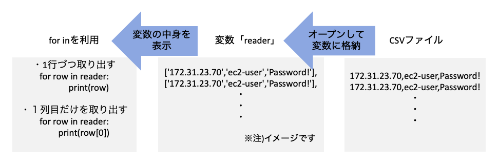

<!-- $theme: default -->

<!-- page_number: true -->

# 第5回 Pymee

課題作成に必要となるCSVモジュール、
paramikoモジュールの基本的な使い方

---

# CSVモジュール

pythonでCSVファイルを取り扱うためのモジュールの使用例

1. CSVファイルをオープンし変数readerに格納します。
1. 読み取ったCSVファイルは行ごとに配列として格納されます。
1. 読み取ったファイルの各行と要素を表示させます。

---

+ some.csv
```
172.31.23.70,ec2-user,P@ssw0rd!
172.30.30.239,ec2-user,P@ssw0rd!
```
上記のファイルをpythonプログラムから読み込みます。

---

+ csvread.py　
```python
import csv
#モジュールのインポート

f = open('some.csv', 'r')
#some.csvファイルを読み込み変数fに格納

reader = csv.reader(f)
#csv.reader(f)はfに格納されている読み込んだファイルの各行を
#文字列のリストとして返す
#ファイルの各行を文字列のリストとして変数readerに格納

```

---
+ csvread.py (前ページからのつづき)
```python
for row in reader:
    print("================================================")
    print("行")
    print(row)

    print("1列目")
    print(row[0])
    print("2列目")
    print(row[1])
    print("3列目")
    print(row[2])
#読み込んだリストの各要素を指定して表示

f.close()
```

---

+ 出力結果
```
[root@ip-172-31-24-55 ~]# python3 csvread.py
['172.31.23.70', 'ec2-user', 'P@ssw0rd!']
['172.30.30.239', 'ec2-user', 'P@ssw0rd!']
================================================
行
['172.31.23.70', 'ec2-user', 'P@ssw0rd!']
1列目
172.31.23.70
2列目
ec2-user
3列目
P@ssw0rd!

================================================
行
['172.30.30.239', 'ec2-user', 'P@ssw0rd!']
1列目
172.30.30.239
2列目
ec2-user
3列目
P@ssw0rd!
```
CSVファイルの行と要素を表示できています。

---



---

# paramikoモジュール

pythonでssh接続するためのparamikoモジュールの使用例

パスワード認証にてサーバにログインすることを想定しています。
ログイン情報は以下の通りです。
+ ログイン対象：172.31.23.70
+ ユーザ：ec2-user
+ パスワード：P@ssw0rd!

上記サーバにて「hostname」コマンドを実行し結果を表示させます。

---

+ sshtest.py

```python
import paramiko
#モジュールのインポート

client = paramiko.SSHClient()
client.set_missing_host_key_policy(paramiko.AutoAddPolicy())
#ログイン対象サーバのホストキーがknown_hostsにない場合に自動追記
client.connect\
('172.31.23.70', username='ec2-user',password='P@ssw0rd!')
#ログイン対象サーバ、ユーザ、パスワードを指定

stdin, stdout, stderr = client.exec_command('hostname')
#実行するコマンドを指定
#client.exec_command('hostname')を以下に格納
#stdin 実行コマンド
#stdout コマンドが正常に実行された場合の結果
#stderr コマンドがエラーだった場合の結果

for line in stdout:
    print(line)

client.close()
#接続をクローズさせる
```


---

+ 出力結果
```
[root@ip-172-31-24-55 ~]# python3 sshtest.py
ip-172-31-23.70.ap-northeast-1.compute.internal
```
ログイン対象である172.31.23.70のホストネームを取得、表示できています。


